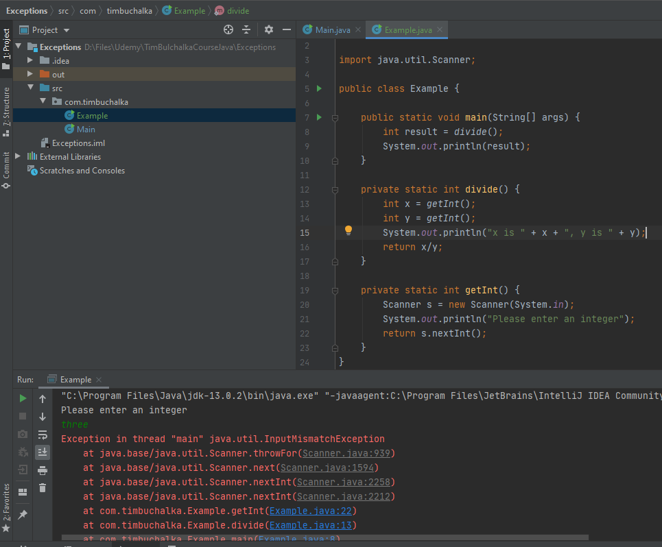
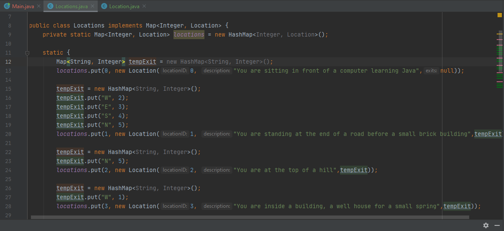

# Basic Input and Output

### Exceptions

Many input/output methods can raise exceptions and there are 2 approaches to handling them.

- LBYL - Look before you Leap

  eg. Check an object is not null

- EAFP - Easy to Ask for Forgiveness than Permission

  Go ahead and perform the operation and then respond to an exception is raised.

Trapping and handling exceptions can be done using a try and catch block.

### Look before you Leap - LBYL

```java
if(y != 0) {
            return x/y;
        } else {
            return 0;
        }
```


### Easy to Ask for Forgiveness than Permission - EAFP

```java
try {
            return x/y;
        } catch(ArithmeticException e) {
            return 0;
        }
```

The code attempts the division and will catch the Exception if it is raised.


Here if we write text not numbers then the raised exception will be a java.util.InputMisMatchException

```java
public static void main(String[] args) {
    int x = getInt();
    System.out.println("x is " + x);
}

private static int getInt() {
    Scanner sc = new Scanner(System.in);
    return sc.nextInt();
}
```


Here is a java.lang.ArithmeticException: / by zero is raised.

```
System.out.println(1/0);
```


Another look before you leap example.

```java
private static int getIntLBYL() {
        Scanner sc = new Scanner(System.in);
        boolean isValid = true;
        System.out.println("Please enter an integer: ");
        String input = sc.next();
        for(int i=0; i < input.length(); i++) {
            if(!Character.isDigit(input.charAt(i))) {
                isValid = false;
                break;
            }
        }

        if(isValid) {
            return Integer.parseInt(input);
        }
        return 0;

    }
```


Less code in the Easier to Ask for Forgiveness than Permissions

```java
private static int getIntEAFP() {
        Scanner sc = new Scanner(System.in);
        System.out.println("Please enter an integer: ");
        try {
            return sc.nextInt();
        } catch (InputMismatchException e) {
            return 0;
        }
        
    }
```


Define Exception: An event which occurs during the execution of the program which disrupts the flow of the programs instructions

When catching an exception you usually specify which subclass of exception we are catching.

For example, here we could have java.lang.ArithmeticException or java.util.InputMismatchException.

Java prints the stack trace (shows the call stack) which is all the method calls at a particular point in the program's execution.

When there is an exception, the call stack is all the methods being called when the program crashed.


```java
package com.timbuchalka;

import java.util.Scanner;

public class Example {

    public static void main(String[] args) {
        int result = divide();
        System.out.println(result);
    }

    private static int divide() {
        int x = getInt();
        int y = getInt();
        System.out.println("x is " + x + ", y is " + y);
        return x/y;
    }

    private static int getInt() {
        Scanner s = new Scanner(System.in);
        System.out.println("Please enter an integer");
        return s.nextInt();
    }
}
```


### print call stack




When a method is called it is placed on top of the stack and when it returns it is removed from the stack. We call the divide which calls the getInt which calls the nextInt method as can be seen in the call stack when the program crashed.

subclasses of exceptions exist to explain the exception.


```java
private static int divide() {
        int x = getInt();
        int y = getInt();
        System.out.println("x is " + x + ", y is " + y);
        return x/y;
    }

    private static int getInt() {
        Scanner s = new Scanner(System.in);
        System.out.println("Please enter an integer: ");

        while(true) {
            try {
                return s.nextInt();
            } catch(InputMismatchException e) {
                // go around again. Read oass the end of line in the input first
                s.nextLine();
                System.out.println("Please enter a number using only the digits 0 through 9");
            }
        }
    }
```


CTRL+D closes the programs input stream.


### Multicatch exceptions

```java
    private static int divide() {
        int x; int y;
        try {
            x = getInt();
            y = getInt();
        } catch (NoSuchElementException e){
            throw new ArithmeticException("No suitable input");
        }

        System.out.println("x is " + x + ", y is " + y);

        try {
            return x/y;
        } catch(ArithmeticException e) {
            throw new ArithmeticException("Attempt to divide by zero");
        }


    }
    
    private static int getInt() {
        Scanner s = new Scanner(System.in);
        System.out.println("Please enter an integer: ");

        while(true) {
            try {
                return s.nextInt();
            } catch(InputMismatchException e) {
                // go around again. Read oass the end of line in the input first
                s.nextLine();
                System.out.println("Please enter a number using only the digits 0 through 9");
            }
        }
    }
```


### Multicatch exceptions

```java
private static int divide() {
        int x; int y;
        try {
            x = getInt();
            y = getInt();
            System.out.println("x is " + x + ", y is " + y);
            return x/y;
        } catch (NoSuchElementException e){
            throw new NoSuchElementException("No suitable input");
        } catch(ArithmeticException e) {
            throw new ArithmeticException("Attempt to divide by zero");
        }


    }
```

Once an exception is catched all remaining exceptions are ignored.


```java
public static void main(String[] args) {

        try {
            int result = divide();
            System.out.println(result);
        } catch (ArithmeticException e) {
            System.out.println(e.toString());
            System.out.println("Unable to perform division, autopilot shutting down");
        }


    }
```


```java
public static void main(String[] args) {

        try {
            int result = divide();
            System.out.println(result);
        } catch (ArithmeticException | NoSuchElementException e) {
            System.out.println(e.toString());
            System.out.println("Unable to perform division, autopilot shutting down");
        }
    }

    private static int divide() {
        int x;
        int y;

        x = getInt();
        y = getInt();
        System.out.println("x is " + x + ", y is " + y);
        return x / y;
    }

    private static int getInt() {
        Scanner s = new Scanner(System.in);
        System.out.println("Please enter an integer: ");

        while(true) {
            try {
                return s.nextInt();
            } catch(InputMismatchException e) {
                // go around again. Read oass the end of line in the input first
                s.nextLine();
                System.out.println("Please enter a number using only the digits 0 through 9");
            }
        }

    }
```


### Input involves reading data from a source and output involves writing to a destination.


When storing classes it may be more appropriate to use a binary format for string the data. Character is the correct type for XML or JSON data.


Sequential data has a set order to reading in the data. eg. a text file

Random access data is not ordered, eg. a database 


The static initialisation block is only executed once when the class is loaded.


Data can be corrupted when the file is not closed.


Can't ignore checked exceptions.

The finally block always run.

```java
public static void main(String[] args) throws IOException {
        FileWriter localFile = null;
        localFile = new FileWriter("locations.txt");
        try {
            for(Location location: locations.values()) {
                localFile.write(location.getLocationID() + "," + location.getDescription() + "\n");
            }
        } catch (IOException e) {
            System.out.println("In catch block");
            e.printStackTrace();
        } finally {
            try {
                if(localFile != null) {
                    System.out.println("Attempting to close locfile");
                    localFile.close();
                }
            } catch (IOException e) {
                e.printStackTrace();
            }
        }


    }
```





FileNotFoundException when a folder already exists called locations.txt and a file is trying to be created by the program called locations.txt.

FileNotFoundException is a subclass of the IOException class.


```java
public static void main(String[] args) throws IOException {
        FileWriter localFile = null;
        localFile = new FileWriter("locations.txt");
        try {
            for(Location location: locations.values()) {
                localFile.write(location.getLocationID() + "," + location.getDescription() + "\n");
            }
        } catch (IOException e) {
            System.out.println("In catch block");
            e.printStackTrace();
        } finally {
            try {
                if(localFile != null) {
                    System.out.println("Attempting to close locfile");
                    localFile.close();
                }
            } catch (IOException e) {
                e.printStackTrace();
            }
        }


    }
```


Write the first line and then throw an IOException. This checks that the file is closed after the IOException is thrown and the file is saved gracefully.

```
public static void main(String[] args) throws IOException {
    FileWriter localFile = null;
    localFile = new FileWriter("locations.txt");
    try {
        for(Location location: locations.values()) {
            localFile.write(location.getLocationID() + "," + location.getDescription() + "\n");
            throw new IOException("test exception thrown while writing");
        }
    } finally {
            if(localFile != null) {
                System.out.println("Attempting to close locfile");
                localFile.close();
            }
        }
}
```


locations.txt

```
0,You are sitting in front of a computer learning Java
```

Still processes the finally clause.


With the try with resources, the file writer is closed gracefully whether or not an exception is raised.

```java
try (FileWriter localFile = new FileWriter("locations.txt")) {
            for (Location location : locations.values()) {
                localFile.write(location.getLocationID() + "," + location.getDescription() + "\n");
                throw new IOException("test exception thrown while writing");
            }
        }
```


The file reader object is passed to the Scanner which then reads in the stream from the file reader. The scanner then works with the data from the FileReader stream.

```java
static {

        Scanner scanner = null;
        try {
            scanner = new Scanner(new FileReader("locations.txt"));
            scanner.useDelimiter(",");
            while(scanner.hasNextLine()) {
                int loc = scanner.nextInt();
                scanner.skip(scanner.delimiter());
                String description = scanner.nextLine();
                System.out.println("Imported loc: " + loc + ": " + description);

                Map<String, Integer> tempExit = new HashMap<I

            }
        } catch (IOException e){
            e.printStackTrace();

        } finally {
            if(scanner != null) {
                scanner.close();
            }
        }
}
```

The scanner's close method takes care of any stream it was using, provide that the stream implements the closeable interface. Automatically handled when the scanner closes.


A buffered reader reads text in from an input stream and buffers the characters into a character array. We will use the Buffered Reader as an input stream for the file to use.


```java
try (FileWriter localFile = new FileWriter("locations.txt");
        FileWriter dirFile = new FileWriter("directions.txt")) {
            for (Location location : locations.values()) {
                localFile.write(location.getLocationID() + "," + location.getDescription() + "\n");

                for (String direction: location.getExits().keySet()) {
                    dirFile.write(location.getLocationID() + "," + direction + "," + location.getExits().get(direction) + "\n");
                }

            }
        }
```


The file Reader is read into the Buffered Reader and the Buffered Reader is read into the Scanner.

Closing the Scanner will close the Buffered Reader and Closing the Buffered Reader will close the File Reader.

The Buffered Reader is both Readable and Closeable so it reads and closes on 

```java
static {

        Scanner scanner = null;
        try {
            scanner = new Scanner(new FileReader("locations.txt"));
            scanner.useDelimiter(",");
            while(scanner.hasNextLine()) {
                int loc = scanner.nextInt();
                scanner.skip(scanner.delimiter());
                String description = scanner.nextLine();
                System.out.println("Imported loc: " + loc + ": " + description);

                Map<String, Integer> tempExit = new HashMap<>();
                locations.put(loc, new Location(loc, description, tempExit));

            }

        } catch (IOException e){
            e.printStackTrace();

        } finally {
            if(scanner != null) {
                scanner.close();
            }
        }


        // Now read the exits

        try {
            scanner = new Scanner(new BufferedReader(new FileReader("directions.txt")));
            scanner.useDelimiter(",");

            while(scanner.hasNextLine()) {
                int loc = scanner.nextInt();
                scanner.skip(scanner.delimiter());
                String direction = scanner.next();
                scanner.skip(scanner.delimiter());
                String dest = scanner.nextLine();
                int destination = Integer.parseInt(dest);
                System.out.println(loc + ": " + direction + ": " + destination);

                Location location = locations.get(loc);
                location.addExit(direction, destination);

            }

        } catch (IOException e) {
            e.printStackTrace();
        } finally {
            if(scanner != null) {
                scanner.close();
            }
        }
```


## Code for the locations and Main


### Main class

```java
public class Main {

    private static Locations locations = new Locations();


    public static void main(String[] args) {
        // Change the program to allow players to type full words, or phrases, then move to the
        // correct location based upon their input.
        // The player should be able to type commands such as "Go West", "run South", or just "East"
        // and the program will move to the appropriate location if there is one.  As at present, an
        // attempt to move in an invalid direction should print a message and remain in the same place.
        //
        // Single letter commands (N, W, S, E, Q) should still be available.

        Scanner scanner = new Scanner(System.in);

        Map<String, String> vocabulary = new HashMap<String, String>();
        vocabulary.put("QUIT", "Q");
        vocabulary.put("NORTH", "N");
        vocabulary.put("SOUTH", "S");
        vocabulary.put("WEST", "W");
        vocabulary.put("EAST", "E");


        int loc = 64;
        while(true) {
            System.out.println(locations.get(loc).getDescription());

            if(loc == 0) {
                break;
            }

            Map<String, Integer> exits = locations.get(loc).getExits();
            System.out.print("Available exits are ");
            for(String exit: exits.keySet()) {
                System.out.print(exit + ", ");
            }
            System.out.println();

            String direction = scanner.nextLine().toUpperCase();
            if(direction.length() > 1) {
                String[] words = direction.split(" ");
                for(String word: words) {
                    if(vocabulary.containsKey(word)) {
                        direction = vocabulary.get(word);
                        break;
                    }
                }
            }

            if(exits.containsKey(direction)) {
                loc = exits.get(direction);

            } else {
                System.out.println("You cannot go in that direction");
            }
        }

    }
}
```


### Locations

```java
public class Locations implements Map<Integer, Location> {
    private static Map<Integer, Location> locations = new HashMap<Integer, Location>();

    public static void main(String[] args) throws IOException {

        try (FileWriter localFile = new FileWriter("locations_big.txt");
        FileWriter dirFile = new FileWriter("directions_big.txt")) {
            for (Location location : locations.values()) {
                localFile.write(location.getLocationID() + "," + location.getDescription() + "\n");

                for (String direction: location.getExits().keySet()) {
                    dirFile.write(location.getLocationID() + "," + direction + "," + location.getExits().get(direction) + "\n");
                }

            }
        }
    }


    static {

        Scanner scanner = null;
        try {
            scanner = new Scanner(new FileReader("locations_big.txt"));
            scanner.useDelimiter(",");
            while(scanner.hasNextLine()) {
                int loc = scanner.nextInt();
                scanner.skip(scanner.delimiter());
                String description = scanner.nextLine();
                System.out.println("Imported loc: " + loc + ": " + description);

                Map<String, Integer> tempExit = new HashMap<>();
                locations.put(loc, new Location(loc, description, tempExit));

            }

        } catch (IOException e){
            e.printStackTrace();

        } finally {
            if(scanner != null) {
                scanner.close();
            }
        }


        // Now read the exits

        try {
            scanner = new Scanner(new BufferedReader(new FileReader("directions_big.txt")));
            scanner.useDelimiter(",");

            while(scanner.hasNextLine()) {
//                int loc = scanner.nextInt();
//                scanner.skip(scanner.delimiter());
//                String direction = scanner.next();
//                scanner.skip(scanner.delimiter());
//                String dest = scanner.nextLine();
//                int destination = Integer.parseInt(dest);

                String input = scanner.nextLine();
                String[] data = input.split(",");
                int loc = Integer.parseInt(data[0]);
                String direction = data[1];
                int destination = Integer.parseInt(data[2]);


                System.out.println(loc + ": " + direction + ": " + destination);

                Location location = locations.get(loc);
                location.addExit(direction, destination);

            }

        } catch (IOException e) {
            e.printStackTrace();
        } finally {
            if(scanner != null) {
                scanner.close();
            }
        }


//        Map<String, Integer> tempExit = new HashMap<String, Integer>();
//        locations.put(0, new Location(0, "You are sitting in front of a computer learning Java",null));
//
//        tempExit = new HashMap<String, Integer>();
//        tempExit.put("W", 2);
//        tempExit.put("E", 3);
//        tempExit.put("S", 4);
//        tempExit.put("N", 5);
//        locations.put(1, new Location(1, "You are standing at the end of a road before a small brick building",tempExit));
//
//        tempExit = new HashMap<String, Integer>();
//        tempExit.put("N", 5);
//        locations.put(2, new Location(2, "You are at the top of a hill",tempExit));
//
//        tempExit = new HashMap<String, Integer>();
//        tempExit.put("W", 1);
//        locations.put(3, new Location(3, "You are inside a building, a well house for a small spring",tempExit));
//
//        tempExit = new HashMap<String, Integer>();
//        tempExit.put("N", 1);
//        tempExit.put("W", 2);
//        locations.put(4, new Location(4, "You are in a valley beside a stream",tempExit));
//
//        tempExit = new HashMap<String, Integer>();
//        tempExit.put("S", 1);
//        tempExit.put("W", 2);
//        locations.put(5, new Location(5, "You are in the forest",tempExit));
//
//
    }


    @Override
    public int size() {
        return locations.size();
    }

    @Override
    public boolean isEmpty() {
        return locations.isEmpty();
    }

    @Override
    public boolean containsKey(Object key) {
        return false;
    }

    @Override
    public boolean containsValue(Object value) {
        return locations.containsValue(value);
    }

    @Override
    public Location get(Object key) {
        return locations.get(key);
    }

    @Override
    public Location put(Integer key, Location value) {
        return locations.put(key, value);
    }

    @Override
    public Location remove(Object key) {
        return locations.remove(key);
    }

    @Override
    public void putAll(Map<? extends Integer, ? extends Location> m) {

    }

    @Override
    public void clear() {
        locations.clear();
    }

    @Override
    public Set<Integer> keySet() {
        return locations.keySet();
    }

    @Override
    public Collection<Location> values() {
        return locations.values();
    }

    @Override
    public Set<Entry<Integer, Location>> entrySet() {
        return locations.entrySet();
    }
}

```


### Location

```java
public class Location {

    private final int locationID;
    private final String description;
    private final Map<String, Integer> exits;

    public Location(int locationID, String description, Map<String, Integer> exits) {
        this.locationID = locationID;
        this.description = description;
        if(exits != null) {
            this.exits = new HashMap<String, Integer>(exits);
        } else {
            this.exits = new HashMap<String, Integer>();
        }
        this.exits.put("Q", 0);
    }

//    public void addExit(String direction, int location) {
//        exits.put(direction, location);
//    }

    public int getLocationID() {
        return locationID;
    }

    public String getDescription() {
        return description;
    }

    public Map<String, Integer> getExits() {
        return new HashMap<String, Integer>(exits);
    }

    protected void addExit(String direction, int location) {
        exits.put(direction, location);
    }

}
```


Buffered reader is optimised to read in chunks at a time.

```
// data is only read from the memory when the buffer is empty
// data is only written to file when the buffer writer is full
```


```java
try (BufferedWriter localFile = new BufferedWriter(new FileWriter("locations_big.txt"));
             BufferedWriter dirFile = new BufferedWriter(new FileWriter("directions_big.txt"))) {
            for (Location location : locations.values()) {
                localFile.write(location.getLocationID() + "," + location.getDescription() + "\n");

                for (String direction: location.getExits().keySet()) {
                    dirFile.write(location.getLocationID() + "," + direction + "," + location.getExits().get(direction) + "\n");
                }

            }
        }
```


Buffered reader reads large chunks of data into memory in the case of a read operation.


The code in the static block is executed before the main method.

The advantage of using binary data is that we do not need to parse it into the variables to be stored. Byte stream can be used to read and write any of the primitive types.


Writing bytestreams.

```java
public static void main(String[] args) throws IOException {


        try (DataOutputStream locFile = new DataOutputStream(new BufferedOutputStream(new FileOutputStream("locations.dat")))) {
            for (Location location: locations.values()) {
                locFile.writeInt(location.getLocationID());
                locFile.writeUTF(location.getDescription());
                System.out.println("Writing location " + location.getLocationID() + " : " + location.getDescription());
                System.out.println("Writing " + (location.getExits().size() - 1) + " exits.");
                locFile.writeInt(location.getExits().size() - 1);

                for(String direction: location.getExits().keySet()) {
                    if(!direction.equalsIgnoreCase("Q")) {
                        System.out.println("\t\t" + direction + "," + location.getExits().get(direction));
                        locFile.writeUTF(direction);
                        locFile.writeInt(location.getExits().get(direction));
                    }
                }

            }
        }
```


Buffered reader ensures that large chunks of data are read into the buffered reader and once it becomes full, it gets emptied.

When writing data, only once the Buffered Writer is full will its contents be written to file. Data is written in sizeable chunks.


## Reading Binary Data and EOF Exceptions

EOF exception is thrown when the end of the file is reached.


### Main.java

```java
public class Main {

    private static Locations locations = new Locations();


    public static void main(String[] args) {
        // Change the program to allow players to type full words, or phrases, then move to the
        // correct location based upon their input.
        // The player should be able to type commands such as "Go West", "run South", or just "East"
        // and the program will move to the appropriate location if there is one.  As at present, an
        // attempt to move in an invalid direction should print a message and remain in the same place.
        //
        // Single letter commands (N, W, S, E, Q) should still be available.

        Scanner scanner = new Scanner(System.in);

        Map<String, String> vocabulary = new HashMap<String, String>();
        vocabulary.put("QUIT", "Q");
        vocabulary.put("NORTH", "N");
        vocabulary.put("SOUTH", "S");
        vocabulary.put("WEST", "W");
        vocabulary.put("EAST", "E");


        int loc = 64;
        while(true) {
            System.out.println(locations.get(loc).getDescription());

            if(loc == 0) {
                break;
            }

            Map<String, Integer> exits = locations.get(loc).getExits();
            System.out.print("Available exits are ");
            for(String exit: exits.keySet()) {
                System.out.print(exit + ", ");
            }
            System.out.println();

            String direction = scanner.nextLine().toUpperCase();
            if(direction.length() > 1) {
                String[] words = direction.split(" ");
                for(String word: words) {
                    if(vocabulary.containsKey(word)) {
                        direction = vocabulary.get(word);
                        break;
                    }
                }
            }

            if(exits.containsKey(direction)) {
                loc = exits.get(direction);

            } else {
                System.out.println("You cannot go in that direction");
            }
        }

    }
}
```


### Locations.java

```java
public class Locations implements Map<Integer, Location> {
    private static Map<Integer, Location> locations = new LinkedHashMap<Integer, Location>();

    public static void main(String[] args) throws IOException {


        try (DataOutputStream locFile = new DataOutputStream(new BufferedOutputStream(new FileOutputStream("locations.dat")))) {
            for (Location location: locations.values()) {
                locFile.writeInt(location.getLocationID());
                locFile.writeUTF(location.getDescription());
                System.out.println("Writing location " + location.getLocationID() + " : " + location.getDescription());
                System.out.println("Writing " + (location.getExits().size() - 1) + " exits.");
                locFile.writeInt(location.getExits().size() - 1);

                for(String direction: location.getExits().keySet()) {
                    if(!direction.equalsIgnoreCase("Q")) {
                        System.out.println("\t\t" + direction + "," + location.getExits().get(direction));
                        locFile.writeUTF(direction);
                        locFile.writeInt(location.getExits().get(direction));
                    }
                }

            }
        }


//        try (BufferedWriter localFile = new BufferedWriter(new FileWriter("locations_big.txt"));
//             BufferedWriter dirFile = new BufferedWriter(new FileWriter("directions_big.txt"))) {
//            for (Location location : locations.values()) {
//                localFile.write(location.getLocationID() + "," + location.getDescription() + "\n");
//
//                for (String direction: location.getExits().keySet()) {
//                    if(!direction.equalsIgnoreCase("Q")) {
//                        dirFile.write(location.getLocationID() + "," + direction + "," + location.getExits().get(direction) + "\n");
//                    }
//                }
//
//            }
//        }
    }


    static {

        try (DataInputStream locFile = new DataInputStream(new BufferedInputStream(new FileInputStream("locations.dat")))) {
            while(true) {
                Map<String, Integer> exits = new LinkedHashMap<String, Integer>();
                int locID = locFile.readInt();
                String description = locFile.readUTF();
                int numExits = locFile.readInt();
                System.out.println("Read location " + locID + " : " + description);
                System.out.println("Found " + numExits + " exits");

                for (int i = 0; i < numExits; i++) {
                    String direction = locFile.readUTF();
                    int destination = locFile.readInt();
                    exits.put(direction, destination);
                    System.out.println("\t\t" + direction + "," + destination);

                }

                locations.put(locID, new Location(locID, description, exits));

            }
        } catch (IOException io) {
            System.out.println("IO Exception");
        }
    }


//        try (Scanner scanner = new Scanner(new BufferedReader(new FileReader("locations_big.txt")))) {
//
//            scanner.useDelimiter(",");
//            while(scanner.hasNextLine()) {
//                int loc = scanner.nextInt();
//                scanner.skip(scanner.delimiter());
//                String description = scanner.nextLine();
//                System.out.println("Imported loc: " + loc + ": " + description);
//
//                Map<String, Integer> tempExit = new HashMap<>();
//                locations.put(loc, new Location(loc, description, tempExit));
//
//            }
//
//        } catch (IOException e){
//            e.printStackTrace();
//
//        }
//
//
//        // Now read the exits
//
//        try (BufferedReader dirFile = new BufferedReader(new FileReader("directions_big.txt"))){
//            // data is only read from the memory when the buffer is empty
//            // data is only written to file when the buffer writer is full
//            String input;
//
//            while( (input = dirFile.readLine()) != null ) {
////                int loc = scanner.nextInt();
////                scanner.skip(scanner.delimiter());
////                String direction = scanner.next();
////                scanner.skip(scanner.delimiter());
////                String dest = scanner.nextLine();
////                int destination = Integer.parseInt(dest);
//
//                String[] data = input.split(",");
//                int loc = Integer.parseInt(data[0]);
//                String direction = data[1];
//                int destination = Integer.parseInt(data[2]);
//
//
//                System.out.println(loc + ": " + direction + ": " + destination);
//
//                Location location = locations.get(loc);
//                location.addExit(direction, destination);
//
//            }
//
//        } catch (IOException e) {
//            e.printStackTrace();
//        }


//        Map<String, Integer> tempExit = new HashMap<String, Integer>();
//        locations.put(0, new Location(0, "You are sitting in front of a computer learning Java",null));
//
//        tempExit = new HashMap<String, Integer>();
//        tempExit.put("W", 2);
//        tempExit.put("E", 3);
//        tempExit.put("S", 4);
//        tempExit.put("N", 5);
//        locations.put(1, new Location(1, "You are standing at the end of a road before a small brick building",tempExit));
//
//        tempExit = new HashMap<String, Integer>();
//        tempExit.put("N", 5);
//        locations.put(2, new Location(2, "You are at the top of a hill",tempExit));
//
//        tempExit = new HashMap<String, Integer>();
//        tempExit.put("W", 1);
//        locations.put(3, new Location(3, "You are inside a building, a well house for a small spring",tempExit));
//
//        tempExit = new HashMap<String, Integer>();
//        tempExit.put("N", 1);
//        tempExit.put("W", 2);
//        locations.put(4, new Location(4, "You are in a valley beside a stream",tempExit));
//
//        tempExit = new HashMap<String, Integer>();
//        tempExit.put("S", 1);
//        tempExit.put("W", 2);
//        locations.put(5, new Location(5, "You are in the forest",tempExit));
//
//


    @Override
    public int size() {
        return locations.size();
    }

    @Override
    public boolean isEmpty() {
        return locations.isEmpty();
    }

    @Override
    public boolean containsKey(Object key) {
        return false;
    }

    @Override
    public boolean containsValue(Object value) {
        return locations.containsValue(value);
    }

    @Override
    public Location get(Object key) {
        return locations.get(key);
    }

    @Override
    public Location put(Integer key, Location value) {
        return locations.put(key, value);
    }

    @Override
    public Location remove(Object key) {
        return locations.remove(key);
    }

    @Override
    public void putAll(Map<? extends Integer, ? extends Location> m) {

    }

    @Override
    public void clear() {
        locations.clear();
    }

    @Override
    public Set<Integer> keySet() {
        return locations.keySet();
    }

    @Override
    public Collection<Location> values() {
        return locations.values();
    }

    @Override
    public Set<Entry<Integer, Location>> entrySet() {
        return locations.entrySet();
    }
}
```


### Location.java

```java
public class Location {

    private final int locationID;
    private final String description;
    private final Map<String, Integer> exits;

    public Location(int locationID, String description, Map<String, Integer> exits) {
        this.locationID = locationID;
        this.description = description;
        if(exits != null) {
            this.exits = new LinkedHashMap<String, Integer>(exits);
        } else {
            this.exits = new LinkedHashMap<String, Integer>();
        }
        this.exits.put("Q", 0);
    }

//    public void addExit(String direction, int location) {
//        exits.put(direction, location);
//    }

    public int getLocationID() {
        return locationID;
    }

    public String getDescription() {
        return description;
    }

    public Map<String, Integer> getExits() {
        return new LinkedHashMap<String, Integer>(exits);
    }

    protected void addExit(String direction, int location) {
        exits.put(direction, location);
    }

}

```


Objects need to be serialisable to be written to a file as is.

Read and write objects as a single unit using Object Input stream and Object output stream.

Objects needs to be translated to a format that can both be stored and later recreated. This is called seralisation.

We need to make the java object serialisable in order to read and write to file. Implements the serialisable interface.

Now the interface doesn't actually have any methods. It just gives the JVM a heads up that we may want to read and write the file to storage.

We also need to set a serial version uid field. Think of it as a version for the class. If we don't set it then the compiler will create it based on class details. When we read an object from a stream, the java run time checks the stored serial version uid against the one contained within the complied class file. If they don't match, then there's a compatibility problem and the run time will throw an invalid class exception.

Make location class serialisable by using the serialisable interface. It does not implement any methods. The linked hash map itself implements the serialisable interface so it can be written to file along with the primitive data types.


Read in objects and Write out objects.


```java
public static void main(String[] args) throws IOException {

        try (ObjectOutputStream locFile = new ObjectOutputStream(new BufferedOutputStream(new FileOutputStream("locations.dat")))) {
            for(Location location: locations.values()) {
                locFile.writeObject(location);
            }

        }
```


```java
    static {

        try (ObjectInputStream locFile = new ObjectInputStream(new BufferedInputStream(new FileInputStream("locations.dat"))) ) {
            boolean eof = false;

            while(!eof) {
                try {
                    Location location = (Location) locFile.readObject();
                    System.out.println("Read location " + location.getLocationID() + " : " + location.getDescription());
                    System.out.println("Found " + location.getExits().size() + " exits");

                    locations.put(location.getLocationID(), location);

                } catch(EOFException e) {
                    eof = true;
                }
            }
        } catch (IOException io) {
            System.out.println("IO Exception " + io.getMessage());
        } catch (ClassNotFoundException io) {
            System.out.println("ClassNotFoundException " + io.getMessage());
        }
    }
```


If two foo instances point to the same bar instance then only one is serialised.

The serialised file will only every contain one copy of the same instance. Object instances are unique within a file but not across files.


This time, let's read the location in everytime a player moves to that location.

This means that we need to move to the particular location in the file rather than just reading in each location sequentially.

This is where random access class coms in.

In such a situation, it would be best to use a database rather than a flat file. In this scenario we will be using a flat file.

The file pointer is an offset in the file where the next read or write will begin from.

Whenever we read/write the file, the file pointer is advanced by the number of bytes we read/write in.

Offset is the byte location in the file. If the offset (file pointer) has value 100 then the pointer is located at value 100.

First byte in the file is in the position 0. 


When using random access files we refer to each set of related data as a record.

In our application, the location id, description and exits make up the record for a location.

When a user moves to a location, how do we know which bytes to be read from the file.

The index stores the record length and offset for each location. 

We will get the index record for the location and use the index values to read in the data.


Will use the file pointer to point to where the first read/write will take place.

The file pointer is always advanced by the number of bytes read or written.

The file pointer will already be position correctly if it is after the file we read or wrote.

Only need to call the seek method when we want to jump to a different offset in the file.


Let's use a random access file and read in locations on demand.


```
write to a random access file
rwd - indicates that we are opening the file for reading and writing and that we want writes to occur snychronously
Each index record will contain 3 integers - the location ID, the offset for the location and the size/ length of the location record
```


Can't do read and write objects with a random access file.


```java
String description = ra.readUTF(); // the write UTF method writes the length of the string followed by the string itself.
        // hence readUTF can read the length of the string and the string itself.
```


```java
ra.seek(record.getStartByte()); // move the file pointer to the locations offset
// using the seek method from the random access file
```


Only reading in the locations one at a time from the Random Access File


The code


### Locations

```java
package com.timbuchalka;

import java.io.*;
import java.util.*;

public class Locations implements Map<Integer, Location> {
    private static Map<Integer, Location> locations = new LinkedHashMap<Integer, Location>();
    private static Map<Integer, IndexRecord> index = new LinkedHashMap<>();
    private static RandomAccessFile ra;

    public static void main(String[] args) throws IOException {

        try (RandomAccessFile rao = new RandomAccessFile("locations_rand.dat", "rwd")) {
            rao.writeInt(locations.size());
            int indexSize = locations.size() * 3 * Integer.BYTES;
            int locationStart = (int) (indexSize + rao.getFilePointer() + Integer.BYTES);
            rao.writeInt(locationStart);

            long indexStart = rao.getFilePointer();

            int startPointer = locationStart;
            rao.seek(startPointer);

            for(Location location : locations.values()) {
                rao.writeInt(location.getLocationID());
                rao.writeUTF(location.getDescription());
                StringBuilder builder = new StringBuilder();
                for(String direction : location.getExits().keySet()) {
                    if(!direction.equalsIgnoreCase("Q")) {
                        builder.append(direction);
                        builder.append(",");
                        builder.append(location.getExits().get(direction));
                        builder.append(",");
                    }
                }
                rao.writeUTF(builder.toString());

                IndexRecord record = new IndexRecord(startPointer, (int) (rao.getFilePointer() - startPointer));
                index.put(location.getLocationID(), record);

                startPointer = (int) rao.getFilePointer();
            }

            rao.seek(indexStart);
            for(Integer locationID : index.keySet()) {
                rao.writeInt(locationID);
                rao.writeInt(index.get(locationID).getStartByte());
                rao.writeInt(index.get(locationID).getLength());
            }

        }

    }

    // 1. This first four bytes will contain the number of locations (bytes 0-3)
    // 2. The next four bytes will contain the start offset of the locations section (bytes 4-7)
    // 3. The next section of the file will contain the index (the index is 1692 bytes long.  It will start at byte 8 and end at byte 1699
    // 4. The final section of the file will contain the location records (the data). It will start at byte 1700


    static {
        try {
            ra = new RandomAccessFile("locations_rand.dat", "rwd");
            int numLocations = ra.readInt();
            long locationStartPoint = ra.readInt();

            while(ra.getFilePointer() < locationStartPoint) {
                int locationId = ra.readInt();
                int locationStart = ra.readInt();
                int locationLength = ra.readInt();

                IndexRecord record = new IndexRecord(locationStart, locationLength);
                index.put(locationId, record);
            }

        } catch(IOException e) {
            System.out.println("IOException in static initializer: " + e.getMessage());
        }
    }

    public Location getLocation(int locationId) throws IOException {

        IndexRecord record = index.get(locationId);
        ra.seek(record.getStartByte());
        int id = ra.readInt();
        String description = ra.readUTF();
        String exits = ra.readUTF();
        String[] exitPart = exits.split(",");

        Location location = new Location(locationId, description, null);

        if(locationId != 0) {
            for(int i=0; i<exitPart.length; i++) {
                System.out.println("exitPart = " + exitPart[i]);
                System.out.println("exitPart[+1] = " + exitPart[i+1]);
                String direction = exitPart[i];
                int destination = Integer.parseInt(exitPart[++i]);
                location.addExit(direction, destination);
            }
        }

        return location;
    }

    @Override
    public int size() {
        return locations.size();
    }

    @Override
    public boolean isEmpty() {
        return locations.isEmpty();
    }

    @Override
    public boolean containsKey(Object key) {
        return locations.containsKey(key);
    }

    @Override
    public boolean containsValue(Object value) {
        return locations.containsValue(value);
    }

    @Override
    public Location get(Object key) {
        return locations.get(key);
    }

    @Override
    public Location put(Integer key, Location value) {
        return locations.put(key, value);
    }

    @Override
    public Location remove(Object key) {
        return locations.remove(key);
    }

    @Override
    public void putAll(Map<? extends Integer, ? extends Location> m) {

    }

    @Override
    public void clear() {
        locations.clear();

    }

    @Override
    public Set<Integer> keySet() {
        return locations.keySet();
    }

    @Override
    public Collection<Location> values() {
        return locations.values();
    }

    @Override
    public Set<Entry<Integer, Location>> entrySet() {
        return locations.entrySet();
    }

    public void close() throws IOException {
        ra.close();
    }
}

```


### Location

```java
public class Location implements Serializable {
    private final int locationID;
    private final String description;
    private final Map<String, Integer> exits;

    private long serialVersionUID = 1L;

    public Location(int locationID, String description, Map<String, Integer> exits) {
        this.locationID = locationID;
        this.description = description;
        if(exits != null) {
            this.exits = new LinkedHashMap<String, Integer>(exits);
        } else {
            this.exits = new LinkedHashMap<String, Integer>();
        }
        this.exits.put("Q", 0);
    }

//    public void addExit(String direction, int location) {
//        exits.put(direction, location);
//    }

    public int getLocationID() {
        return locationID;
    }

    public String getDescription() {
        return description;
    }

    public Map<String, Integer> getExits() {
        return new LinkedHashMap<String, Integer>(exits);
    }
    protected void addExit(String direction, int location) {
        exits.put(direction, location);
    }
}
```


### Main

```java
public class Main {

    private static Locations locations = new Locations();


    public static void main(String[] args) throws IOException {
        // Change the program to allow players to type full words, or phrases, then move to the
        // correct location based upon their input.
        // The player should be able to type commands such as "Go West", "run South", or just "East"
        // and the program will move to the appropriate location if there is one.  As at present, an
        // attempt to move in an invalid direction should print a message and remain in the same place.
        //
        // Single letter commands (N, W, S, E, Q) should still be available.

        // File format:
        // 1. The first 4 bytes will contain the number of locations (bytes 0-3)
        // 2. The next four bytes will contain the start offset of the locations section (bytes 4-7)
        // . The next section of the file will contain the index (the index is 1692 bytes long. It will start at byte 8 and end at byte 1699.
        // 3. The next section of the file will contain the location records (the data). It will start at byte 1700.


        Scanner scanner = new Scanner(System.in);

        Map<String, String> vocabulary = new HashMap<String, String>();
        vocabulary.put("QUIT", "Q");
        vocabulary.put("NORTH", "N");
        vocabulary.put("SOUTH", "S");
        vocabulary.put("WEST", "W");
        vocabulary.put("EAST", "E");


        int loc = 64;
        Location currentLocation = locations.getLocation(64);
        while(true) {
            System.out.println(currentLocation.getDescription());

            // if we reach location 0 then we break out of the program
            if(currentLocation.getLocationID() == 0) {
                break;
            }

            Map<String, Integer> exits = currentLocation.getExits();
            System.out.print("Available exits are ");
            for(String exit: exits.keySet()) {
                System.out.print(exit + ", ");
            }
            System.out.println();

            String direction = scanner.nextLine().toUpperCase();
            if(direction.length() > 1) {
                String[] words = direction.split(" ");
                for(String word: words) {
                    if(vocabulary.containsKey(word)) {
                        direction = vocabulary.get(word);
                        break;
                    }
                }
            }

            if(exits.containsKey(direction)) {
                currentLocation = locations.getLocation(currentLocation.getExits().get(direction));

            } else {
                System.out.println("You cannot go in that direction");
            }
        }

        locations.close();

    }
}
```


### Concurrency/Threads


A process is a unit of execution that has its own memory space. Each application has its own memory space of heap. 

Process and application can be used interchangeable. Process <-> Application.

The 1st application can't access the heap that belongs to the 2nd Java application. The heap isn't shared between them. They have their own.


