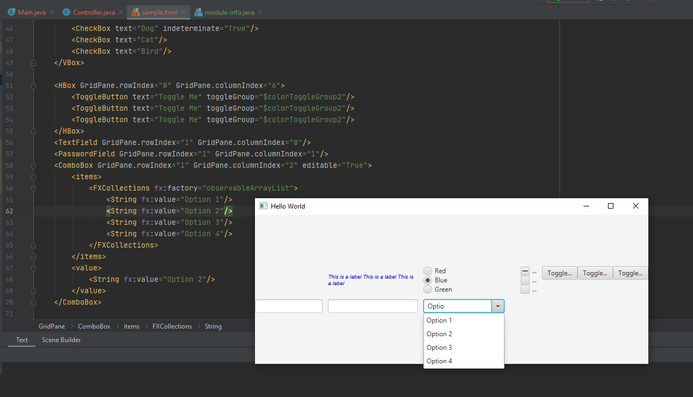

Install JavaFX Windows SDK from gluonhq.com

Put the folder somewhere where it would not be deleted and extract it


Define a global library so we can use JavaFX in any project we like.

```
Configure -> global libraries -> add symbol -> select all jar files in lib folder

rename to javafx 11
```


Create new project -> javafx


// JavaFX 11 is not part of Java11 so we have to set up up.

Click on project structure -> global libraries -> right click JavaFX-11 -> add to modules

Note: There should be an *Add to modules* option if not already selected.


Need to configure javafx to work.

Add a module-info.java file so we have defined javafx controller.


In this file, include 

```
module Tim.Bulchalka.course {

    requires javafx.fxml;
    requires javafx.controls;
    
    opens sample;

}
```

// sample is the package names


Javafx application comes from javafx.application.Application

Javafx applications must have a class that extends Application. Application manages the life cycle of the application. 

We care about init, start and stop.

When we run the application, Application.Launch is run from the main method. It launches the Javafx application and only finishes when the Javafx application exits

Init method runs first. Then the start method. We need to override it because it is an abstract method in the Application class.

When the application finishes, eg. the user closes the application, the stop method is run. It is empty, unless we override it.


Stage extends the window class and is a top-level java container. Javafx window contructs the initial stage and passes it to the start method.

We use a dialogue class to wrap a stage.

Line 13 loads the UI from the fxml file.


fxml is a flavour of xml

fx:controller attribute tell the run time which class is the controller for.

When we load in the sample.fxml file, all of the UI objects are constructed.

sample is the package and controller is the class.

To load in an fxml file 

```
Parent root = FXMLLoader.load(getClass().getResource("sample.fxml"));
```

Since the window class is the parent of the stage class, the window title will be set to hello world.

Only node in the sample.fxml is the gridpane so it is the root of the scene graph.

The java developers were going for a theatre metaphor each stage requires a scene and backing each scene is a graph were each node corresponds to a UI control or an area of the scene.

Parent classes decends directly from Node class which is the base class for scene graph nodes

Nodes that descend from parent can have child in the scene graph eg. GridPane is the root of the scene graph.


Stage is a top level Ui container whilst the scene is backed by a scene graph which contains the UI nodes. To change the UI we just need to change the scene. In practice, we load in a new fxml file and call stage .set scene. Just changes the scene every time a user clicks next.


Lets not use fxml files and instead use code. Create a gridpane node and make it the root of our scene.

Set alignment and gaps for the GridPane
```
GridPane root = new GridPane();
root.setAlignment(Pos.CENTER);
root.setVgap(10)
root.setHgap(10);
```


Set greeting. Add the label to thre pane by using the get children method which returned a list of the children. No shortcut.

```
Label greeting = new Label("Welcome to JavaFX!");
greeting.setTextFill(Color.GREEN);
greeting.setFont(Font.font("Times New Roman", FontWeight.BOLD, 70));
root.getChildren().add(greeting);
```


Set title and show stage

```
primaryStage.setTitle("Hello JavaFX");
primaryStage.setScene(new Scene(root, 700, 275));
primaryStage.show();
```


In fxml

```
<GridPane fx:controller="sample.Controller"
          xmlns:fx="http://javafx.com/fxml" alignment="center" hgap="10" vgap="10">
    <Label text="Welcome to JavaFX!" textFill="green">
        <font>
            <Font name="Times New Roman bold" size="70"/>
        </font>
    </Label>
</GridPane>
```


We will focus on fxml route. Best practice to define UI through fxml.

Don't need to touch code when change fxml.


Focus on fxml route. FXML is good practice because it forces you to seperate your business logic from your UI. Changes how the javafx application looks without changing a line of code.


Javafx has 8 layouts: GridPane, StackPane, AnchorPane, Hbox, Vbox, FlowPane, BorderPane, TilePane

Layout allow adding controls to a UI container without having to write code to managed to resizing and repositioning of those controls. Layouts manage all of this.

Controls have a Preferred width and height based, it is based on its contents.

The button control had large text then it would resize itself so its border fits around the text.

When a control is place within a layout it becomes a child of the layout.

GridPane has cells within it. Lays out its children within those cells. The rows and columns sizes are flexible. Row will be as large as the largest control it contains and the columns will be as large as the largest control it contains.


GridPane


Default position is column 0 row 0.

```
<GridPane fx:controller="sample.Controller"
          xmlns:fx="http://javafx.com/fxml" alignment="center" hgap="10" vgap="10">
    <Button text="Button One"/>
    <Button text="Button Two"/>
    <Button text="Button Three"/>
    <Button text="Really Long Button Four"/>
    <Button text="Button Five"/>
    
</GridPane>
```


Each row is the height of the tallest control and each column is the width of the widest row

The gap between each row and column is 10.


Alignment is by default set to center

```gridLinesVisible="true"```

10 pixel gap between each row and 10 pixel gap between each column

Use gridLinesVisible equal to true for debugging.


```
gridLinesVisible="true"
```


1st constraint applies to the first column, 2nd constraint applies to the second column.

Ordering matters!

```
<columnConstraints>
    <ColumnConstraints percentWidth="50.0"/>
    <ColumnConstraints percentWidth="50.0"/>
</columnConstraints>
```


alignment="top_center"


Can put in padding on the top above buttons

```
<padding>
	<Insets top="50"/>
</padding>
```


Change GridPane alignment

```
<GridPane fx:controller="sample.Controller"
          xmlns:fx="http://javafx.com/fxml" alignment="top_center" hgap="10" vgap="10" gridLinesVisible="true">
```


Change Button alignment

```
<GridPane fx:controller="sample.Controller"
          xmlns:fx="http://javafx.com/fxml" alignment="top_center" hgap="10" vgap="10" gridLinesVisible="true">
```


Change row or column span of buttons

```
<Button text="Really Long Button Four" GridPane.rowIndex="0" GridPane.columnIndex="0" GridPane.columnSpan="2"/>
```


HBox lays out children in a row and sizes them to their preferred widths.

HBox will stretch itself to fill excess and not its children to fill the excess

fillheight=true by default, hbox will fill extra height

fillheight=false then children will be stretched to fill extra height


Hbox example


```
<HBox fx:controller="sample.Controller"
      xmlns:fx="http://javafx.com/fxml" alignment="top_center" style="-fx-border-color: red; -fx-border-width: 3; -fx-border-style: dashed">
    <Button text="Okay"/>
    <Button text="Cancel"/>
    <Button text="Help"/>
</HBox>
```


Hbox bordering

```
<HBox fx:controller="sample.Controller"
      xmlns:fx="http://javafx.com/fxml" alignment="top_center"
style="-fx-border-color: red; -fx-border-width: 3;-fx-border-style: dashed">
    <Button text="Okay"/>
    <Button text="Cancel"/>
    <Button text="Help"/>
</HBox>
```


Inserting padding and do pref width

```
<HBox fx:controller="sample.Controller"
      xmlns:fx="http://javafx.com/fxml" alignment="bottom_right" style="-fx-border-color: red; -fx-border-width: 3; -fx-border-style: dashed"
spacing="10">

    <padding>
        <Insets bottom="10" right="10"/>
    </padding>

    <Button text="Okay" prefWidth="120"/>
    <Button text="Cancel" prefWidth="120"/>
    <Button text="Help" prefWidth="120"/>
</HBox>
```


### BorderPane layout

BorderPane places controls in 1 of 5 positions: Top, Bottom, Left, Right, Center


Works well for client applications.

Tree or list to the left. Menu or toolbar to the top,

Central area to place data

Information panel to the right hand side

Status bar to the bottom


Children in Top and bottom positions get preferred heights


Center position gets space left over.

No space is allocated to empty position


HBox layout is made to be a child of the borderpane layout

HBox is nested within the BorderPane


Alignment property tells us how the layout's children should be aligned

```
<BorderPane fx:controller="sample.Controller" xmlns:fx="http://javafx.com/fxml">

    <top>
        <Label text="This label is in the top position" alignment="CENTER"
        BorderPane.alignment="center"
        style="-fx-border-color: blue; -fx-border-width: 3; -fx-border-style: dashed"/>
    </top>
    <bottom>
        <HBox spacing="10" alignment="bottom_right">
            <padding>
                <Insets bottom="10" right="10"/>
            </padding>
            <Button text="Okay" prefWidth="90"/>
            <Button text="Cancel" prefWidth="90"/>
            <Button text="Help" prefWidth="90"/>
        </HBox>
    </bottom>
</BorderPane>
```


Can set alignment for children within borderpane.


Controls in left and right positions of a border pane will be sized to their preferred widths


```
<BorderPane fx:controller="sample.Controller" xmlns:fx="http://javafx.com/fxml">

    <top>
        <Label text="This label is in the top position" alignment="CENTER"
               BorderPane.alignment="top_right"
               style="-fx-border-color: blue; -fx-border-width: 3; -fx-border-style: dashed"/>
    </top>

    <left>
        <Label text="This label is in the left position" alignment="center"/>
    </left>

    <right>
        <Label text="This label is in the right position" alignment="center"/>
    </right>

    <center>
        <Label text="This Label is in the center position and has really long text loooooooooonnnnnngggg"/>
    </center>

    <bottom>
        <HBox spacing="10" alignment="center">
            <padding>
                <Insets bottom="10" right="10"/>
            </padding>
            <Button text="Okay" prefHeight="90" prefWidth="90"/>
            <Button text="Cancel" prefWidth="90"/>
            <Button text="Help" prefWidth="90"/>
        </HBox>
    </bottom>
</BorderPane>
```


Center will get space left over after controls are placed in other positions.


If the controls in the top, bottom, left and right positions weren't already at their preferred heights they would expand before space is given to the center position.


Anchor pane anchor children to the edges. Eg. a title to the top of the pane, a hbox with buttons to the bottom.


FlowPane layout wraps its children to the next row when the orientation is set to horizontal.

```
<FlowPane fx:controller="sample.Controller" xmlns:fx="http://javafx.com/fxml" orientation="HORIZONTAL">
    <Button text="Button One"/>
    <Button text="Button Two"/>
    <Button text="Button Three"/>
    <Button text="Button Four"/>
    <Button text="Button Five"/>
    <Button text="Button Six"/>
    <Button text="Button Seven"/>
    <Button text="Button Eight"/>
    <Button text="Button Nine"/>
    <Button text="Button Ten"/>
</FlowPane>

```


VBox stacks the buttons vertically and cuts them off when the screen becomes small.


When you don't know how many children there will be, eg. programatically, use flowpane.

When you know how many children there will be, use vbox


TilePane is similar to a flowpane but every cell or tile has the same size


Each tile has the width of the largest button. Buttons are centered in each cell.


## Stack pane layout

Stack pane stacks all the controls on top of eachother

```
<StackPane fx:controller="sample.Controller"
           xmlns:fx="http://javafx.com/fxml">
    <Label text="The label text" style="-fx-background-color: green"/>
    <Button text="Button One" style="-fx-background-color: red"/>
</StackPane>
```

The order in which we add the controls to the fxml will determine the order of the controls on the stack pane. The first control we add will be on the bottom of the stack and the last control will be on the top. 0th child is on the bottom, last child is on the top.


```
<GridPane fx:controller="sample.Controller"
           xmlns:fx="http://javafx.com/fxml" alignment="center" hgap="10" vgap="10">
    <Button GridPane.rowIndex="0" GridPane.columnIndex="0" text="Click Me"/>
</GridPane>
```


To know properties that can be set on a control, go to the docs https://docs.oracle.com/javase/8/javafx/api/javafx/scene/control/Button.html


Node is the base class forall scene graph nodes.

Button inherits from Control and Control inherits from Node

Button has cancelButton and defaultButton properties.

Button inherits height as well as many other properties.


Every Javafx control provide a default implementation of the Skinnable interface.

Text comes from the labelled class


# Controls


Add JARs or directories


Project Structure -> Modules -> Adds Jars or 

Add jar file called jifgr-1_0.jar. Renamed it to graphics.

Find graphics in:

jlfgr-1_0.jar -> toolbarButtonGraphics -> general 


Choose Classes so it adds the Jar to the class path.

@ means going to the root


The text is cut off.

Add a graphic child element to the Button element.

```
<GridPane fx:controller="sample.Controller"
          xmlns:fx="http://javafx.com/fxml" alignment="center" hgap="10" vgap="10">
    <Button GridPane.rowIndex="0" GridPane.columnIndex="0" text="Click Me">
        <graphic>
            <ImageView>
                <Image url="@/toolbarButtonGraphics/general/TipOfTheDay24.gif"/>
            </ImageView>
        </graphic>
    </Button>
    <Label GridPane.rowIndex="0" GridPane.columnIndex="1" text="This is a label This is a label This is a label"
        textFill="blue">
        <font>
            <Font name="Arial italic" size="40"/>
        </font>
        <graphic>
            <ImageView>
                <Image url="@/toolbarButtonGraphics/general/Information24.gif"/>
            </ImageView>
        </graphic>
    </Label>
</GridPane>
```


Can set wrap text equal to true

```
<GridPane fx:controller="sample.Controller"
          xmlns:fx="http://javafx.com/fxml" alignment="center" hgap="10" vgap="10">
    <Label GridPane.rowIndex="0" GridPane.columnIndex="1" text="This is a label This is a label This is a label"
           textFill="blue" wrapText="True">
    <font>
            <Font name="Arial italic" size="40"/>
    </font>
    </Label>
</GridPane>
    
```


## Wrap text


Radio button can be selected or deselected.

Can put radio buttons together so that only one can be selected at a time.

Radio buttons can be added to a toggle group


$ sign is for finding an fx id

fx:define is for adding something not part of the scene graph. Use selected="True" for automatically selecting a radio button to true

Only one radio button can be selected at a time

```
    <RadioButton GridPane.rowIndex="0" GridPane.columnIndex="2" text="Red" toggleGroup="$colorToggleGroup"/>
    <RadioButton GridPane.rowIndex="0" GridPane.columnIndex="3" text="Blue" toggleGroup="$colorToggleGroup" selected="True"/>
    <RadioButton GridPane.rowIndex="0" GridPane.columnIndex="4" text="Green" toggleGroup="$colorToggleGroup"/>
```


Indetermine state on means it initially has a dash. No real practical use for it

Can set one choice from a group of checkboxes.

Radiobuttons descend from toggle button class.

Toggle button node does not extend from scene graph so we have to use fx:define.

For fx id, we need to use a $ sign.

Toggle button is a control in its own right and stay down after being clicked.

To make a button selected by default, use the selected property.


Checkbox has two states. Either selected or not selected.

You can enable the indeterminate state, which is a dash.


Toggle button is like a regular button except when we press it, it stays down.

To enable only one toggle button to be selected at a time, use a toggle group.

```
<GridPane fx:controller="sample.Controller"
          xmlns:fx="http://javafx.com/fxml" alignment="center" hgap="10" vgap="10">
    <Button GridPane.rowIndex="0" GridPane.columnIndex="0" text="Click Me">
        <graphic>
            <ImageView>
                <Image url="@/toolbarButtonGraphics/general/TipOfTheDay24.gif"/>
            </ImageView>
        </graphic>
    </Button>
    <Label GridPane.rowIndex="0" GridPane.columnIndex="1" text="This is a label This is a label This is a label"
        textFill="blue" WrapText="true">
        <font>
            <Font name="Arial italic" size="12"/>
        </font>
        <graphic>
            <ImageView>
                <Image url="@/toolbarButtonGraphics/general/Information24.gif"/>
            </ImageView>
        </graphic>
    </Label>

    <fx:define>
        <ToggleGroup fx:id="colorToggleGroup"/>
    </fx:define>

    <RadioButton GridPane.rowIndex="0" GridPane.columnIndex="2" text="Red" toggleGroup="$colorToggleGroup"/>
    <RadioButton GridPane.rowIndex="0" GridPane.columnIndex="3" text="Blue" toggleGroup="$colorToggleGroup" selected="True"/>
    <RadioButton GridPane.rowIndex="0" GridPane.columnIndex="4" text="Green" toggleGroup="$colorToggleGroup"/>

    <VBox GridPane.rowIndex="0" GridPane.columnIndex="5">
        <CheckBox text="Dog"/>
        <CheckBox text="Cat"/>
        <CheckBox text="Bird"/>
    </VBox>

    <HBox GridPane.rowIndex="0" GridPane.columnIndex="6">
        <ToggleButton text="Toggle Me"/>
        <ToggleButton text="Toggle Me"/>
        <ToggleButton text="Toggle Me"/>
    </HBox>


</GridPane>
```


Textfield allows a user to type information in and perform action with the data.

Textfield has copy, cut, paste

 PasswordField does not have copy and cut functionality and masks itself. However, it inherits on textfield and looks very similar.


Need packages

We will populate the combo box with a list of strings

```
<ComboBox GridPane.rowIndex="1" GridPane.columnIndex="2">
        <items>
            <FXCollections fx:factory="observableArrayList">
                <String fx:value="Option 1"/>
                <String fx:value="Option 2"/>
                <String fx:value="Option 3"/>
                <String fx:value="Option 4"/>
            </FXCollections>
        </items>
    </ComboBox>
```


<?import javafx.collections.FXCollections?>
<?import javafx.collections.*?>
<?import java.lang.String?>

```
<?import javafx.geometry.Insets?>
<?import javafx.scene.layout.GridPane?>

<?import javafx.scene.control.Button?>
<?import javafx.scene.control.Label?>
<?import javafx.scene.image.ImageView?>
<?import javafx.scene.image.Image?>
<?import javafx.scene.text.Font?>
<?import javafx.scene.control.RadioButton?>
<?import javafx.scene.control.ToggleGroup?>
<?import javafx.scene.layout.VBox?>
<?import javafx.scene.control.CheckBox?>
<?import javafx.scene.control.ToggleButton?>
<?import javafx.scene.layout.HBox?>
<?import javafx.scene.control.TextField?>
<?import javafx.scene.control.PasswordField?>
<?import javafx.scene.control.ComboBox?>
<?import javafx.collections.FXCollections?>
<?import javafx.collections.*?>
<?import java.lang.String?>
<GridPane fx:controller="sample.Controller"
          xmlns:fx="http://javafx.com/fxml" alignment="center" hgap="10" vgap="10">
    <Label GridPane.rowIndex="0" GridPane.columnIndex="1" text="This is a label This is a label This is a label"
           textFill="blue" wrapText="True">
    <font>
            <Font name="Arial italic" size="10"/>
    </font>
    </Label>

    <fx:define>
        <ToggleGroup fx:id="colorToggleGroup"/>
    </fx:define>

    <fx:define>
        <ToggleGroup fx:id="colorToggleGroup2"/>
    </fx:define>

    <VBox GridPane.rowIndex="0" GridPane.columnIndex="2">
        <RadioButton text="Red" toggleGroup="$colorToggleGroup"/>
        <RadioButton text="Blue" toggleGroup="$colorToggleGroup" selected="True"/>
        <RadioButton text="Green" toggleGroup="$colorToggleGroup"/>
    </VBox>


    <VBox GridPane.rowIndex="0" GridPane.columnIndex="5">
        <CheckBox text="Dog" indeterminate="True"/>
        <CheckBox text="Cat"/>
        <CheckBox text="Bird"/>
    </VBox>

    <HBox GridPane.rowIndex="0" GridPane.columnIndex="6">
        <ToggleButton text="Toggle Me" toggleGroup="$colorToggleGroup2"/>
        <ToggleButton text="Toggle Me" toggleGroup="$colorToggleGroup2"/>
        <ToggleButton text="Toggle Me" toggleGroup="$colorToggleGroup2"/>
    </HBox>
    <TextField GridPane.rowIndex="1" GridPane.columnIndex="0"/>
    <PasswordField GridPane.rowIndex="1" GridPane.columnIndex="1"/>
    <ComboBox GridPane.rowIndex="1" GridPane.columnIndex="2">
        <items>
            <FXCollections fx:factory="observableArrayList">
                <String fx:value="Option 1"/>
                <String fx:value="Option 2"/>
                <String fx:value="Option 3"/>
                <String fx:value="Option 4"/>
            </FXCollections>
        </items>
    </ComboBox>

</GridPane>
```


Use observable Array List to list out the values in a Combo box.

To set a default, use

```
<ComboBox GridPane.rowIndex="1" GridPane.columnIndex="2">
        <items>
            <FXCollections fx:factory="observableArrayList">
                <String fx:value="Option 1"/>
                <String fx:value="Option 2"/>
                <String fx:value="Option 3"/>
                <String fx:value="Option 4"/>
            </FXCollections>
        </items>
        <value>
            <String fx:value="Option 2"/>
        </value>
</ComboBox>
```


Can set editable property to true

``` editable="True"```





Choicebox has a tick infront of it. Good for a small amount of items. 

```
<ChoiceBox GridPane.rowIndex="1" GridPane.columnSpan="4">
        <items>
            <FXCollections fx:factory="observableArrayList">
                <String fx:value="cb 1"/>
                <String fx:value="cb 2"/>
                <String fx:value="cb 3"/>
                <String fx:value="cb 4"/>
                <String fx:value="cb 5"/>
            </FXCollections>
        </items>
    </ChoiceBox>
```


Combo box is good for a large number of items


```
<Slider GridPane.rowIndex="2" GridPane.columnIndex="0" GridPane.columnSpan="4"
            min="0" max="100" showTickLabels="true" showTickMarks="true" minorTickCount="4" snapToTicks="true"/>
```


Spinner control is quite new. version 8 java

Is very important to press enter to change value

```
<Spinner GridPane.rowIndex="2" GridPane.columnIndex="4" min="0" max="100" editable="true" initialValue="50"/>
```

Color picker

```
<ColorPicker GridPane.rowIndex="3" GridPane.columnIndex="0"/>
```


Date picker


Titled Pane is a control and not a layout. We can add to it an accordion. Only lets one titled pane be open at a time. Cannot make it horizontal. $ sign to signify that it is an id

Group of titled panes and one 1 can be open at any time.

Assign id to one that is to be open.


```
<Accordion GridPane.rowIndex="3" GridPane.columnIndex="2" GridPane.columnSpan="2"
    expandedPane="$tp3">
        <panes>
            <TitledPane text="Titled Pane">
                <Label text="Label in title pane"/>
            </TitledPane>
            <TitledPane text="Titled Pane">
                <Label text="Label 2 in title pane"/>
            </TitledPane>
            <TitledPane fx:id="tp3" text="Titled Pane">
                <Label text="Label 3 in title pane"/>
            </TitledPane>
        </panes>
    </Accordion>

```

Check the documentation to see what is and isn't possible.


# Event handlers


When a control is interacted with it will run a function called an event handler.


Procedural driven applications don't have a GUI. We have a rough idea what happens when.

Event driven applications have a UI. User dictates what runs when.

Such as Intellij. One user may create a new project or open the settings dialogue.

Run initialisation code, build UI and then wait for input from the user. Application will run code based on the user event.

Life cycle is that it builds the initialisation code, build main UI and wait for user input. Java application will run a particular event based on user input

Java application thread know as the UI thread waits for User input.

An event is raised on the UI thread when the button is pressed and will see if any part of the application has expressed interested in handling that particular control.


We want to run an event handler when the button is pressed.

Controller handles user input. Associate event handler with the button.

UI thread checks whether there is an event handler. Our application listens for events hence the name EventHandler.

Handling an event is sometimes referred to as listening for an event so EventHandlers are sometimes called eventListeners.

We need to associate the event handler with the button. Need to associate textField in the controller class to the control in the fxml file.

Annotate textField declaration.

At runtime, the program injected the reference to the textField into the name field variable.


```
<GridPane fx:controller="sample.Controller"
          xmlns:fx="http://javafx.com/fxml" alignment="center" hgap="10" vgap="10">
    <TextField fx:id="nameField" GridPane.rowIndex="1" GridPane.columnIndex="0"/>
    <Button text="Say Hello" GridPane.rowIndex="0" GridPane.columnIndex="0" onAction="#onButtonClicked"/>
</GridPane>
```


```
@FXML
private TextField nameField;

@FXML
public void onButtonClicked() {
    System.out.println("Hello, " + nameField.getText());
}
```


```
@FXML
    private TextField nameField;

    @FXML
    public void onButtonClicked() {
        System.out.println("Hello, " + nameField.getText());
    }
```


We can use the same event handler for different controls. Therefore, we need to pass through ActionEvent e as a paramter to know which one is whihc.

Can add ActionEvent parameter to eventhandler. Can used get source to see where the event was started from

```
    @FXML
    private TextField nameField;
    @FXML
    private Button helloButton;
    @FXML
    private Button byeButton;

    @FXML
    public void onButtonClicked(ActionEvent e) {
        if(e.getSource().equals(helloButton)) {
            System.out.println("Hello, " + nameField.getText());
        } else if (e.getSource().equals(byeButton)) {
            System.out.println("Bye, " + nameField.getText());
        }
    }
```


Check that the field isn't empty

Listen for a character typed into a text field


disable buttons if there is no text. Run this function every time a button is pressed into the field

```
@FXML
    public void handleKeyReleased() {
        String text = nameField.getText();
        boolean disabledButtons = text.isEmpty() || text.trim().isEmpty();
        helloButton.setDisable(disabledButtons);
        byeButton.setDisable(disabledButtons);
    }
```


On initialisation, this method runs.

```
@FXML
public void initalize() {
hellobutton.setDisable(true);
byebutton.setDisable(true);
}
```


Associated eventhandler to textfield


```
<GridPane fx:controller="sample.Controller"
          xmlns:fx="http://javafx.com/fxml" alignment="center" hgap="10" vgap="10">
    <TextField fx:id="nameField" GridPane.rowIndex="1" GridPane.columnIndex="0" onKeyReleased="#handleKeyReleased"/>
    <Button fx:id="helloButton" text="Say Hello" GridPane.rowIndex="0" GridPane.columnIndex="0" onAction="#onButtonClicked"/>
    <Button fx:id="byeButton" text="Say Bye" GridPane.rowIndex="0" GridPane.columnIndex="1" onAction="#onButtonClicked"/>
</GridPane>
```


On key released method.

```
<GridPane fx:controller="sample.Controller"
          xmlns:fx="http://javafx.com/fxml" alignment="center" hgap="10" vgap="10">
    <TextField fx:id="nameField" GridPane.columnIndex="0" GridPane.rowIndex="0"
    onKeyReleased="#handleKeyReleased"/>
    <Button fx:id="helloButton" text="Say Hello" GridPane.rowIndex="1" GridPane.columnIndex="0" onAction="#onButtonClicked"/>
    <Button fx:id="byeButton" text="Say Bye" GridPane.rowIndex="1" GridPane.columnIndex="1" onAction="#onButtonClicked"/>
</GridPane>
```


Check the state of the checkbox when checking it

```
public void handleChange() {
    System.out.println("The checkbox is " + (ourCheckBox.isSelected() ? "checked" : "not checked"));
}
```


```
@FXML
    public void initialize() {
        helloButton.setDisable(true);
        byeButton.setDisable(true);
    }

    @FXML
    public void onButtonClicked(ActionEvent e) {
        if(e.getSource().equals(helloButton)) {
            System.out.println("Hello, " + nameField.getText());
        } else if (e.getSource().equals(byeButton)) {
            System.out.println("Bye, " + nameField.getText());
        }

        if(ourCheckbox.isSelected()) {
            nameField.clear();
            helloButton.setDisable(true);
            byeButton.setDisable(true);

        }

    }

    @FXML
    public void handleKeyReleased() {
        String text = nameField.getText();
        boolean disabledButtons = text.isEmpty() || text.trim().isEmpty();
        helloButton.setDisable(disabledButtons);
        byeButton.setDisable(disabledButtons);
    }

    public void handleChange() {
        System.out.println("The checkbox is " + (ourCheckbox.isSelected() ? "checked": "not checked"));
    }
```


Never expect users to be always predictable. Write a lot of cases and verification.

When an event is raised, an associated error is run.

Go to the docs to see which events that a control can raise.

Javafx 8 control docs


195 UI thread

Event handler runs on UI thread. So when event handler runs, the UI thread is busy

UI Thread sits and waits for user input. Application won't respond. 

UI thread sees if the application is listening for that event and if so it dispatches the event to the event handler. Event handler will run on UI thread. Whilst an event handler is running, the UI is busy and is no longer paying attention to the user input. User can't interact with UI when it is busy. 


Event handler can put application in limbo.


Background thread takes a long time to work. Will inform the UI when it is done.


If more than one thread can alter a node, then the node's internal integrity could be compromised. Two processes running at the same time which conflict with eachother.

Whenever we want to work with nodes on the scene graph, we actually must do so on the JavaFX application thread.

Will use the run later method, going to put the runnable thread on a queue. Forces the runnable object to run on a UI thread.


```
try {
    Thread.sleep(15000);
} catch (InterruptedException ex) {
    //
}
```


EventHandler running on the UI thread isn't optimal.

The event handler should start another thread if it takes a long time.

The event handler, running on the UI thread should be able to return so the UI can listen to user input again. The thread that is kicked off is called the background thread.

Update the label after 10 seconds.

Start the background thread using new Thread(task).start();

UI thread will continue as normal.

```
@FXML
public void onButtonClicked(ActionEvent e) {

    if(e.getSource().equals(helloButton)) {
        System.out.println("Hello, " + nameField.getText());
    } else if (e.getSource().equals(byeButton)) {
        System.out.println("Bye, " + nameField.getText());
    }

    // create another process on your computer
    // will run in a background thread
    // put code you want executed in the run method

    Runnable task = new Runnable() {
        @Override
        public void run() {
            try {
                Thread.sleep(15000);
                Platform.runLater(new Runnable() {
                    @Override
                    public void run() {
                        ourLabel.setText("We did something!");
                    }
                });
            } catch (InterruptedException event) {
                // we don't care about this
            }
        }
    };
    
    new Thread(task).start();

    if(ourCheckBox.isSelected()) {
        nameField.clear();
        helloButton.setDisable(true);
        byeButton.setDisable(true);
    }

}
```


Background threads and UI threads

To ensure it is being run on the UI thread use Platform.runLater

```
Runnable task = new Runnable() {
            @Override
            public void run() {
                try {

                    String s = Platform.isFxApplicationThread() ? "UI Thread" : "Background Thread";
                    System.out.println("I'm going to sleep on the: " + s);
                    Thread.sleep(10000);

                    Platform.runLater(new Runnable() {
                        @Override
                        public void run() {
                            String s = Platform.isFxApplicationThread() ? "UI Thread" : "Background Thread";
                            System.out.println("I'm updating the label on the: " + s);
                            ourLabel.setText("We did something");
                        }
                    });
                } catch (InterruptedException event) {
                    // we don't care about this
                }
            }
        };
```

Can read about concurrency in concurrency in JavaFX


Application for to do list.


Todo list will be for list of items. Add to the left side of the screen.


Populate list with list items

To display short description, override toString method.

getSelectedItem to get the item selected from the model.


```
<TextArea fx:id="itemDetailsTextArea" VBox.vgrow="ALWAYS"
```


Give as much room as possible to the text area. Will size the children to the preferrred height before giving all the other area to the text area.


Make sure the VBox background colour is white

```
<BorderPane fx:controller="sample.Controller"
            xmlns:fx="http://javafx.com/fxml">
    <left>
        <ListView fx:id="todoListView" onMouseClicked="#handleClickListView">

        </ListView>
    </left>
    <center>
        <VBox style="-fx-background-color: white">
            <TextArea fx:id="itemDetailsTextArea" VBox.vgrow="ALWAYS"/>
            <HBox>
                <Label text="Due: " style="-fx-background-color: white">
                    <font>
                        <Font name="Times New Roman bold" size="20"/>
                    </font>
                </Label>
                <Label fx:id="deadlineLabel" style="-fx-background-color: white">
                    <font>
                        <Font name="Times New Roman bold" size="20"/>
                    </font>
                </Label>
            </HBox>
        </VBox>

    </center>
</BorderPane>
```


Add listener so that it runs whenever the value of the item property is changed

When an event is raised its associated event handler is run. Override the change method and using an anonymous class. 


Used a datetime formatter


Users should be able to add items to the todo list. Would expect them to be saved after the application is closed.


Singleton has private constructor so no other class can create an instance. Can only create one singleton class. One instance of itself. Singleton usually contains a static method so that any class can get the single instance and call its method. Use a singleton when we want there ot be only one class created over the entire run of the application.

Singleton class create the one instance of itself. 

Add singleton class to the data model package.

Singletons usually has a static method so that any class can get its instance and call its methods.

```
public static TodoData getInstance() {
        return instance;
    }
```


Users would want to add items to the interface.

To do items should be loaded and stored to a flat file. We want to save items


Should probably use a database.

Delimiter is tab.

Can't instantiate the class from outside.


# Base Interface


## Controller

```
public class Controller {

    private List<ToDoItem> toDoItems;

    @FXML
    private ListView todoListView;

    public void initialize() {
        ToDoItem item1 = new ToDoItem("Mail birthday card", "Buy a 30th birthday card for John",
                LocalDate.of(2016, Month.APRIL, 25));
        ToDoItem item2 = new ToDoItem("Doctor's Appointment", "See Dr. Smith at 123 Main Street. Bring paperwork",
                LocalDate.of(2016, Month.MAY, 23));
        ToDoItem item3 = new ToDoItem("Finish design proposal for client", "I promise Mike I'd email website mockups by Friday 22nd April",
                LocalDate.of(2016, Month.APRIL, 22));
        ToDoItem item4 = new ToDoItem("Pickup Doug at the train", "Doug's arriving on March",
                LocalDate.of(2016, Month.MARCH, 23));
        ToDoItem item5 = new ToDoItem("Pick up dry cleaning", "The clothes should be ready by Wednesday",
                LocalDate.of(2016, Month.APRIL, 20));

        toDoItems = new ArrayList<ToDoItem>();
        toDoItems.add(item1);
        toDoItems.add(item2);
        toDoItems.add(item3);
        toDoItems.add(item4);
        toDoItems.add(item5);

        todoListView.getItems().setAll(toDoItems);
        todoListView.getSelectionModel().setSelectionMode(SelectionMode.SINGLE);


    }

}
```


## sample.fxml

```
<BorderPane fx:controller="sample.Controller"
            xmlns:fx="http://javafx.com/fxml">
    <left>
        <ListView fx:id="todolist">

        </ListView>
    </left>
</BorderPane>
```


We want the details to take up all of the left over space.

The selection model tracks what item is selected


Give the textarea as much rom as possible.

```
<TextArea fx:id="itemDetailsTextArea" VBox.vgrow="ALWAYS"/>
```


## Code up to 200 Formatting Dates

```
public class Controller {

    private List<ToDoItem> toDoItems;

    @FXML
    private ListView<ToDoItem> todoListView;

    @FXML
    private TextArea itemDetailsTextArea;

    @FXML
    private Label deadlineLabel;


    public void initialize() {
        ToDoItem item1 = new ToDoItem("Mail birthday card", "Buy a 30th birthday card for John",
                LocalDate.of(2016, Month.APRIL, 25));
        ToDoItem item2 = new ToDoItem("Doctor's Appointment", "See Dr. Smith at 123 Main Street. Bring paperwork",
                LocalDate.of(2016, Month.MAY, 23));
        ToDoItem item3 = new ToDoItem("Finish design proposal for client", "I promise Mike I'd email website mockups by Friday 22nd April",
                LocalDate.of(2016, Month.APRIL, 22));
        ToDoItem item4 = new ToDoItem("Pickup Doug at the train", "Doug's arriving on March",
                LocalDate.of(2016, Month.MARCH, 23));
        ToDoItem item5 = new ToDoItem("Pick up dry cleaning", "The clothes should be ready by Wednesday",
                LocalDate.of(2016, Month.APRIL, 20));

        toDoItems = new ArrayList<ToDoItem>();
        toDoItems.add(item1);
        toDoItems.add(item2);
        toDoItems.add(item3);
        toDoItems.add(item4);
        toDoItems.add(item5);


        // make sure first item is selected in the todo list when the applicaiton is run

        // listen for changes in the selected item property and run this code
        // event handlers are also called event listeners since they listen out foir changes
        // veyr common to use lambda expressions
        todoListView.getSelectionModel().selectedItemProperty().addListener(new ChangeListener<ToDoItem>() {
            @Override
            public void changed(ObservableValue<? extends ToDoItem> observableValue, ToDoItem oldValue, ToDoItem newValue) {
                if(newValue != null) {
                    ToDoItem item = todoListView.getSelectionModel().getSelectedItem();
                    itemDetailsTextArea.setText(item.getDetails());
                    deadlineLabel.setText(item.getDeadline().toString());
                }
            }
        });

        todoListView.getItems().setAll(toDoItems);
        todoListView.getSelectionModel().setSelectionMode(SelectionMode.SINGLE);
        todoListView.getSelectionModel().selectFirst();

    }

//    @FXML
//    public void handleClickListView() {
//        ToDoItem item = todoListView.getSelectionModel().getSelectedItem();
//        //System.out.println("The selected item is " + item);
////        itemDetailsTextArea.setText(item.getDetails());
////        StringBuilder sb = new StringBuilder(item.getDetails());
////        sb.append("\n\n\n\n");
////        sb.append("Due: ");
////        sb.append(item.getDeadline());
////        itemDetailsTextArea.setText(sb.toString());
//
//        itemDetailsTextArea.setText(item.getDetails());
//        deadlineLabel.setText(item.getDeadline().toString());
//
//
//    }


}
```


```
<BorderPane fx:controller="sample.Controller"
            xmlns:fx="http://javafx.com/fxml">
    <left>
        <ListView fx:id="todoListView">

        </ListView>
    </left>

    <center>
        <VBox style="-fx-background-color: white">
        <TextArea fx:id="itemDetailsTextArea" VBox.vgrow="ALWAYS"/>
            <HBox>
                <Label text="Due: " style="-fx-background-color: white">
                    <font>
                        <Font name="Times New Roman bold" size="20"/>
                    </font>
                </Label>
                <Label fx:id="deadlineLabel" text="Due: " style="-fx-background-color: white">
                    <font>
                        <Font name="Times New Roman bold" size="20"/>
                    </font>
                </Label>


            </HBox>
        </VBox>
    </center>

</BorderPane>
```


### Can use date formatter


```
todoListView.getSelectionModel().selectedItemProperty().addListener(new ChangeListener<ToDoItem>() {
            @Override
            public void changed(ObservableValue<? extends ToDoItem> observableValue, ToDoItem oldValue, ToDoItem newValue) {
                if(newValue != null) {
                    ToDoItem item = todoListView.getSelectionModel().getSelectedItem();
                    itemDetailsTextArea.setText(item.getDetails());
                    DateTimeFormatter df = DateTimeFormatter.ofPattern("MMMM dd, yyyy");
                    // DateTimeFormatter df = DateTimeFormatter.ofPattern("d M yy");
                    deadlineLabel.setText(df.format(item.getDeadline()));
                }
            }
        });
```


```
todoListView.getSelectionModel().selectedItemProperty().addListener(new ChangeListener<ToDoItem>() {
            @Override
            public void changed(ObservableValue<? extends ToDoItem> observableValue, ToDoItem oldValue, ToDoItem newValue) {
                if(newValue != null) {
                    ToDoItem item = todoListView.getSelectionModel().getSelectedItem();
                    itemDetailsTextArea.setText(item.getDetails());
                    DateTimeFormatter df = DateTimeFormatter.ofPattern("MMMM dd, yyyy");
                    // DateTimeFormatter df = DateTimeFormatter.ofPattern("d M yy");
                    deadlineLabel.setText(df.format(item.getDeadline()));
                }
            }
        });

        todoListView.getItems().setAll(TodoData.getInstance().getTodoItems());
        todoListView.getSelectionModel().setSelectionMode(SelectionMode.SINGLE);
        todoListView.getSelectionModel().selectFirst();
```


Override the stop method 


Add a singleton class - only one instance of the class is created over run of application. It can be accessed by the controller and the main class. Private constructor makes sure no more than one instance is created.

Usually contains static method allows for getting the single instance and its methods.


Store the data using the stop method to a flat file.


TodoData singleton class.

Add singleton class to datamodel package.

Use getinstance method to get reference it


```
public class TodoData {

    private static TodoData instance = new TodoData();
    private static String filename = "TodoListItems.txt";
    private List<ToDoItem> todoItems;
    private DateTimeFormatter formatter;

    public static TodoData getInstance() {
        return instance;
    }

    private TodoData() {
        formatter = DateTimeFormatter.ofPattern("dd-MM-yyyy");

    }

    public List<ToDoItem> getTodoItems() {
        return todoItems;
    }


    public void loadTodoItems() throws IOException {
        todoItems = FXCollections.observableArrayList();
        Path path = Paths.get(filename);

        BufferedReader br = Files.newBufferedReader(path);

        String input;

        try {
            while ((input = br.readLine()) != null) {
                String[] itemPieces = input.split("\t");

                String shortDescription = itemPieces[0];
                String details = itemPieces[1];
                String dateString = itemPieces[2];

                LocalDate date = LocalDate.parse(dateString, formatter);

                ToDoItem todoItem = new ToDoItem(shortDescription, details, date);
                todoItems.add(todoItem);
            }

        } finally {
            if (br != null) {
                br.close();
            }
        }


    }


    public void storeToDoItems() throws IOException {

        Path path = Paths.get(filename);
        BufferedWriter bw = Files.newBufferedWriter(path);
        try {
            Iterator<ToDoItem> iter = todoItems.iterator();
            while (iter.hasNext()) {
                ToDoItem item = iter.next();
                bw.write(String.format("%s\t%s\t%s",
                        item.getShortDescription(),
                        item.getDetails(),
                        item.getDeadline().format(formatter)));
                bw.newLine();
            }

        } finally {
            if (bw != null) {
                bw.close();
            }
        }

    }


}

```


We use an ObservableArrayList because the code todoListView.getItems().setAll(toDoItems);

setAll command can only be used on an ObservableArrayList.


The stop method runs when the user exists the application


Create new fxml file and new controller for it.

Want dialogue to be model so that the user can't use anything else in the UI.

Need to exit the dialogue before the rest of the UI becomes active.

DialogPane is a layout for dialogs and lets us set the header, graphics, content and buttons

Has header and content string.

Header proiperty is a string proerpty

Add eventhandler to the controller class

Assign an id to the borderpane so we can use it in the controller.

Set the dialogue owner or parent to the window it was open from. This is good practice.

Owner must be of type window. We can refer to it in the controller

```
dialog.initOwner(mainBorderPane.getScene().getWindow());
```

Dialogues have a dialogue pane so lets set it 

```
dialog.getDialogPane().setContent(root);
```


When a user presses file and new we want our new dialogue to pop up.

Add butttons to the dialogue pane.


Show method returns immediately after showing the dialogue.

But we want the event handler to be suspended whilst the user interacts with the dialogue.

We want the showandwait method to suspend the eventhandler until a response is given.


Associated event handler with the control in the fxml file

Use the selection model to select the newly added item.

```
todoListView.getSelectionModel().select(newItem);
```


Databinding is when a control knows when its data changes. JavaFX developers have written code for this.

When items are added or deleted from the collection the controller will change what is shown on the screen.


Callback


We need to provide the call back or the method that the list view wants to call each time it wants to paint one of its cells.


Cell Factory


Override updateItem method. This method will run whenever the list view wants to paint a cell.

Each item in the listview is in a cell. We can customise how those cells look by using the setCellFactory method to assign a custom cell factory. The default cell factory sets the text to whatever the item to string method returns

 

```
todoListView.setCellFactory(new Callback<ListView<ToDoItem>, ListCell<ToDoItem>>() {
            @Override
            public ListCell<ToDoItem> call(ListView<ToDoItem> toDoItemListView) {
                ListCell<ToDoItem> cell = new ListCell<ToDoItem>() {

                    @Override
                    protected void updateItem(ToDoItem item, boolean empty) {
                        super.updateItem(item, empty);
                        // if the cell is empty
                        if(empty) {
                            setText(null);
                        } else {
                            setText(item.getShortDescription());
                            if(item.getDeadline().isBefore(LocalDate.now().plusDays(1))) {
                                setTextFill(Color.RED);
                            } else if(item.getDeadline().equals(LocalDate.now().plusDays(1))) {
                                setTextFill(Color.YELLOW);
                            }
                        }
                    }
                };

                cell.emptyProperty().addListener(
                        (obs, wasEmpty, isNowEmpty) -> {
                            if(isNowEmpty) {
                                cell.setContextMenu(null);
                            } else {
                                cell.setContextMenu(listContextMenu);
                            }
                        }
                );

                return cell;
            }
        });
```


We pass an anonymous class which using the class back interface. It has two parameters, the 


oding the edit case is very similar to the add case.


Context menu depending on what is selected.


Use confirmation dialogue to confirm which item to delete.


We use databinding. The list knows that something had changed and updates accordingly.

Java Developers have written code to handle the changes.

When it


For a window modal dialog, if you set an owner, the dialog will block input for the owner stage and the user won't be able to close the owner stage without first closing the child.

If the window model dialog does not have an owner, the user can easily switch between a field in the owner dialog until the child dialog is closed.


When a key is pressed, a key event can be raised and the key event handler associated with the text field is called.


Tooltip property expects to be assigned a instance of the tooltip class, not a string. It tries to convert the string into a tooltip but can't.


Generally we start with a capital letter when we define a class and start with lowercase for properties.


GridPane lays out child components in a grid. TilePane makes all tiles the same size.

When adding new components to a GridPane, you specify the row and column to insert the component and the span.


```

```

FX Collections has utility methods that are optimised to reduce the number of notifcations that are raised when the collection is changed.that are raised


Create a Context Menu with a delete item.

Give an Alert so that we can confirm the deletion.

Need to set the title text, header text and context text.

some of the properties will be set for us. eg. an OKay and cancel button will be automatically created for a confirmation alert.


WE have associated the handler to the context menu and written the code for the handler. We need to now associate the context menu with the listview.

Click on a control to bring it into focus.

When a key is pressed, a key event is raised. A key handler can be used to handle that key event.


We need to provide the sorted list with a comparator so that it knows how to sort the ToDoItems.


/sample

- datamodel/
  	- TodoData
  	- ToDoItem
	- Controller
	- DialogueController
	- Main
	- sample.fxml
	- todoItemDialog.fxml


### Controller 

```
public class Controller {

    private List<ToDoItem> toDoItems;

    @FXML
    private ListView<ToDoItem> todoListView;

    @FXML
    private TextArea itemDetailsTextArea;

    @FXML
    private Label deadlineLabel;

    @FXML
    private BorderPane mainBorderPane;

    @FXML
    private ContextMenu listContextMenu;

    @FXML
    private ToggleButton filterToggleButton;

    private FilteredList<ToDoItem> filteredList;

    private Predicate<ToDoItem> wantAllItems;

    private Predicate<ToDoItem> wantTodaysItems;


    public void initialize() {


        // make sure first item is selected in the todo list when the applicaiton is run

        // listen for changes in the selected item property and run this code
        // event handlers are also called event listeners since they listen out foir changes
        // veyr common to use lambda expressions

        listContextMenu = new ContextMenu();
        MenuItem deleteMenuItem = new MenuItem("Delete");
        deleteMenuItem.setOnAction(new EventHandler<ActionEvent>() {
            @Override
            public void handle(ActionEvent event) {
                ToDoItem item = todoListView.getSelectionModel().getSelectedItem();
                deleteItem(item);
            }
        });

        // Add the delete item to the content menu
        listContextMenu.getItems().addAll(deleteMenuItem);


        todoListView.getSelectionModel().selectedItemProperty().addListener(new ChangeListener<ToDoItem>() {
            @Override
            public void changed(ObservableValue<? extends ToDoItem> observableValue, ToDoItem oldValue, ToDoItem newValue) {
                if (newValue != null) {
                    ToDoItem item = todoListView.getSelectionModel().getSelectedItem();
                    itemDetailsTextArea.setText(item.getDetails());
                    DateTimeFormatter df = DateTimeFormatter.ofPattern("MMMM dd, yyyy");
                    // DateTimeFormatter df = DateTimeFormatter.ofPattern("d M yy");
                    deadlineLabel.setText(df.format(item.getDeadline()));
                }
            }
        });

        // pass in the list to be sorted and the anonymous compare function which tells the sorted list how to
        // order the two items.
        // For the parameters, get the observable list and write the comparator as an anonymous class
        // pass in the two TodoItems to compare and write a method to compared them.

        // use a predicate for filtering items in a list
        // the test method will called on every item in the list past to it.
        // if test returns false then the item is not kept
        // if test return true then the item is kept

        // then pass the filtered list to the sorted list


        wantAllItems = new Predicate<ToDoItem>() {

            @Override
            public boolean test(ToDoItem toDoItem) {
                return true;
            }
        };

        wantTodaysItems = new Predicate<ToDoItem>() {

            @Override
            public boolean test(ToDoItem toDoItem) {
                return (toDoItem.getDeadline().equals(LocalDate.now()));
            }
        };


        filteredList = new FilteredList<ToDoItem>(TodoData.getInstance().getTodoItems(),
                wantAllItems);

        // the filtered list is being passed
        SortedList<ToDoItem> sortedList = new SortedList<ToDoItem>(filteredList,
                new Comparator<ToDoItem>() {
                @Override
                    public int compare(ToDoItem o1, ToDoItem o2) {
                        // compare the two values of the dates
                        return o1.getDeadline().compareTo(o2.getDeadline());
                }
        });

        //todoListView.setItems(TodoData.getInstance().getTodoItems());

        // bind the list view to the observable list in the data class
        todoListView.setItems(sortedList);
        todoListView.getSelectionModel().setSelectionMode(SelectionMode.SINGLE);
        todoListView.getSelectionModel().selectFirst();

        todoListView.setCellFactory(new Callback<ListView<ToDoItem>, ListCell<ToDoItem>>() {
            @Override
            public ListCell<ToDoItem> call(ListView<ToDoItem> toDoItemListView) {
                ListCell<ToDoItem> cell = new ListCell<ToDoItem>() {

                    @Override
                    protected void updateItem(ToDoItem item, boolean empty) {
                        super.updateItem(item, empty);
                        // if the cell is empty
                        if(empty) {
                            setText(null);
                        } else {
                            setText(item.getShortDescription());
                            if(item.getDeadline().isBefore(LocalDate.now().plusDays(1))) {
                                setTextFill(Color.RED);
                            } else if(item.getDeadline().equals(LocalDate.now().plusDays(1))) {
                                setTextFill(Color.YELLOW);
                            }
                        }
                    }
                };

                cell.emptyProperty().addListener(
                        (obs, wasEmpty, isNowEmpty) -> {
                            if(isNowEmpty) {
                                cell.setContextMenu(null);
                            } else {
                                cell.setContextMenu(listContextMenu);
                            }
                        }
                );

                return cell;
            }
        });
    }

//    @FXML
//    public void handleClickListView() {
//        ToDoItem item = todoListView.getSelectionModel().getSelectedItem();
//        //System.out.println("The selected item is " + item);
////        itemDetailsTextArea.setText(item.getDetails());
////        StringBuilder sb = new StringBuilder(item.getDetails());
////        sb.append("\n\n\n\n");
////        sb.append("Due: ");
////        sb.append(item.getDeadline());
////        itemDetailsTextArea.setText(sb.toString());
//
//        itemDetailsTextArea.setText(item.getDetails());
//        deadlineLabel.setText(item.getDeadline().toString());
//
//
//    }


    @FXML
    public void showNewItemDialog() {
        Dialog<ButtonType> dialog = new Dialog<>();
        //dialog.initOwner(mainBorderPane.getScene().getWindow());
        dialog.setTitle("Add New Todo Item");
        dialog.setHeaderText("Use this dialogue to created a new item");

        FXMLLoader fxmlLoader = new FXMLLoader();
        fxmlLoader.setLocation(getClass().getResource("todoItemDialog.fxml"));

        try {
            dialog.getDialogPane().setContent(fxmlLoader.load());

        } catch(IOException e) {
            System.out.println("Couldn't load the dialog");
            e.printStackTrace();
            return;
        }

        dialog.getDialogPane().getButtonTypes().add(ButtonType.OK);
        dialog.getDialogPane().getButtonTypes().add(ButtonType.CANCEL);


        Optional<ButtonType> result = dialog.showAndWait();
        if(result.isPresent() && result.get() == ButtonType.OK) {
            DialogueController controller = fxmlLoader.getController();
            ToDoItem newItem = controller.processResults();
            // todoListView.getItems().setAll(TodoData.getInstance().getTodoItems());
            todoListView.getSelectionModel().select(newItem);

        }

    }

    @FXML
    public void handleKeyPressed(KeyEvent event) {
        ToDoItem selectedItem = todoListView.getSelectionModel().getSelectedItem();
        if(selectedItem != null) {
            if (event.getCode().equals(KeyCode.DELETE)) {
                deleteItem(selectedItem);
            }
        }
    }


    public void deleteItem(ToDoItem item) {
        Alert alert = new Alert(Alert.AlertType.CONFIRMATION);
        alert.setTitle("Delete Todo Item");
        alert.setHeaderText("Delete item: " + item.getShortDescription());
        alert.setContentText("Are you sure? Press OK to confirm, or cancel to back out.");
        Optional<ButtonType> result = alert.showAndWait();

        if(result.isPresent() && (result.get() == ButtonType.OK)) {
            TodoData.getInstance().deleteToDoItem(item);
        }

    }

    @FXML
    public void handleFilterButton() {
        // when the button isn't selected we want to show all items
        // when the button is selected we want to show items due today

        ToDoItem selectedItem = todoListView.getSelectionModel().getSelectedItem();

        if(filterToggleButton.isSelected()) {
            filteredList.setPredicate(wantTodaysItems);
            if(filteredList.isEmpty()) {
                itemDetailsTextArea.clear();
                deadlineLabel.setText("");
            } else if (filteredList.contains(selectedItem)) {
                todoListView.getSelectionModel().select(selectedItem);
            } else {
                todoListView.getSelectionModel().selectFirst();
            }
        } else {
            filteredList.setPredicate(wantAllItems);
            todoListView.getSelectionModel().select(selectedItem);

        }

    }

    @FXML
    public void handleExit() {
        Platform.exit();
    }


}

```


### Main

```
public class Main extends Application {

    @Override
    public void start(Stage primaryStage) throws Exception{
        Parent root = FXMLLoader.load(getClass().getResource("sample.fxml"));
        primaryStage.setTitle("Todo List");
        primaryStage.setScene(new Scene(root, 900, 500));
        primaryStage.show();
    }


    public static void main(String[] args) {
        launch(args);
    }

    @Override
    public void init() throws Exception {
        try {
            // store data to text file
            TodoData.getInstance().loadTodoItems();

        } catch(IOException e) {
            System.out.println(e.getMessage());
        }
    }


    @Override
    public void stop() throws Exception {
        try {
            // store data to text file
            TodoData.getInstance().storeToDoItems();

        } catch(IOException e) {
            System.out.println(e.getMessage());
        }
    }
}
```


### DialogueController

```
public class DialogueController {

    @FXML
    private TextField shortDescriptionField;

    @FXML
    private TextArea detailsArea;

    @FXML
    private DatePicker deadlinePicker;

    // gather the users input and create a todo item

    public ToDoItem processResults() {
        String shortDescription = shortDescriptionField.getText().trim();
        String details = detailsArea.getText().trim();
        LocalDate deadlineValue = deadlinePicker.getValue();

        ToDoItem newItem = new ToDoItem(shortDescription, details, deadlineValue);
        TodoData.getInstance().addTodoItem(newItem);
        return newItem;

    }


}
```


### sample.fxml

```
<BorderPane fx:id="mainBorderPane" fx:controller="sample.Controller"
            xmlns:fx="http://javafx.com/fxml">

    <top>
        <VBox>
            <MenuBar>
                <Menu text="File">
                    <items>
                        <MenuItem text="New..." onAction="#showNewItemDialog"/>
                        <SeparatorMenuItem  />
                        <MenuItem text="Exit" onAction="#handleExit"/>
                    </items>
                </Menu>
            </MenuBar>

            <ToolBar>
                <HBox>
                    <Button text="New..." onAction="#showNewItemDialog">
                        <tooltip>
                            <Tooltip text="Add a New Todo Item"/>
                        </tooltip>
                    </Button>
                    <ToggleButton fx:id="filterToggleButton" text="Today's Items" onAction="#handleFilterButton">
                        <tooltip>
                            <Tooltip text="Button Down: Show Today's items only. Button Only: Show Yesterday's items only."/>
                        </tooltip>
                    </ToggleButton>
                </HBox>
            </ToolBar>

        </VBox>
    </top>


    <left>
        <ListView fx:id="todoListView" onKeyReleased="#handleKeyPressed">

        </ListView>
    </left>

    <center>
        <VBox style="-fx-background-color: white">
        <TextArea fx:id="itemDetailsTextArea" VBox.vgrow="ALWAYS" wrapText="true"/>
            <HBox>
                <Label text="Due: " style="-fx-background-color: white">
                    <font>
                        <Font name="Times New Roman bold" size="20"/>
                    </font>
                </Label>
                <Label fx:id="deadlineLabel" text="Due: " style="-fx-background-color: white">
                    <font>
                        <Font name="Times New Roman bold" size="20"/>
                    </font>
                </Label>


            </HBox>
        </VBox>
    </center>

</BorderPane>
```


### todoItemDialog.fxml

```
<DialogPane fx:controller="sample.DialogueController"
            xmlns:fx="http://javafx.com/fxml">
    <headerText>
        We could put instructions here
    </headerText>
    <content>
        <GridPane vgap="10" hgap="10">
            <Label text="Short Description: " GridPane.rowIndex="0" GridPane.columnIndex="0"/>
            <TextField fx:id="shortDescriptionField" GridPane.rowIndex="0" GridPane.columnIndex="1"/>
            <Label text="Details:" GridPane.rowIndex="1" GridPane.columnIndex="0"/>
            <TextArea fx:id="detailsArea" GridPane.rowIndex="1" GridPane.columnIndex="1" wrapText="true"/>
            <Label text="Deadline:" GridPane.rowIndex="2" GridPane.columnIndex="0"/>
            <DatePicker fx:id="deadlinePicker" GridPane.rowIndex="2" GridPane.columnIndex="1"/>

        </GridPane>
    </content>

</DialogPane>
```


### module-info.java

```
module TodoList {

    requires javafx.fxml;
    requires javafx.controls;

    opens sample;

}
```


### TodoData

```
package sample.datamodel;

public class TodoData {

    private static TodoData instance = new TodoData();
    private static String filename = "TodoListItems.txt";
    private ObservableList<ToDoItem> todoItems;
    private DateTimeFormatter formatter;

    public static TodoData getInstance() {
        return instance;
    }

    private TodoData() {
        formatter = DateTimeFormatter.ofPattern("dd-MM-yyyy");

    }

    public ObservableList<ToDoItem> getTodoItems() {
        return todoItems;
    }


    public void loadTodoItems() throws IOException {
        todoItems = FXCollections.observableArrayList();
        Path path = Paths.get(filename);

        BufferedReader br = Files.newBufferedReader(path);

        String input;

        try {
            while ((input = br.readLine()) != null) {
                String[] itemPieces = input.split("\t");

                String shortDescription = itemPieces[0];
                String details = itemPieces[1];
                String dateString = itemPieces[2];

                LocalDate date = LocalDate.parse(dateString, formatter);

                ToDoItem todoItem = new ToDoItem(shortDescription, details, date);
                todoItems.add(todoItem);
            }

        } finally {
            if (br != null) {
                br.close();
            }
        }


    }


    public void storeToDoItems() throws IOException {

        Path path = Paths.get(filename);
        BufferedWriter bw = Files.newBufferedWriter(path);
        try {
            Iterator<ToDoItem> iter = todoItems.iterator();
            while (iter.hasNext()) {
                ToDoItem item = iter.next();
                bw.write(String.format("%s\t%s\t%s",
                        item.getShortDescription(),
                        item.getDetails(),
                        item.getDeadline().format(formatter)));
                bw.newLine();
            }

        } finally {
            if (bw != null) {
                bw.close();
            }
        }

    }


    public void deleteToDoItem(ToDoItem item) {
        todoItems.remove(item);
    }


    public List<ToDoItem> getDoItems() {
        return todoItems;
    }


    public void addTodoItem(ToDoItem item) {
        todoItems.add(item);
    }


}
```


```
package sample.datamodel;

import java.time.LocalDate;

public class ToDoItem {

    private String shortDescription;
    private String details;
    private LocalDate deadline;

    public ToDoItem(String shortDescription, String details, LocalDate deadline) {
        this.shortDescription = shortDescription;
        this.details = details;
        this.deadline = deadline;
    }

    public String getShortDescription() {
        return shortDescription;
    }

    public void setShortDescription(String shortDescription) {
        this.shortDescription = shortDescription;
    }

    public String getDetails() {
        return details;
    }

    public void setDetails(String details) {
        this.details = details;
    }

    public LocalDate getDeadline() {
        return deadline;
    }

    public void setDeadline(LocalDate deadline) {
        this.deadline = deadline;
    }


//    @Override
//    public String toString() {
//        return shortDescription;
//    }
}

```

